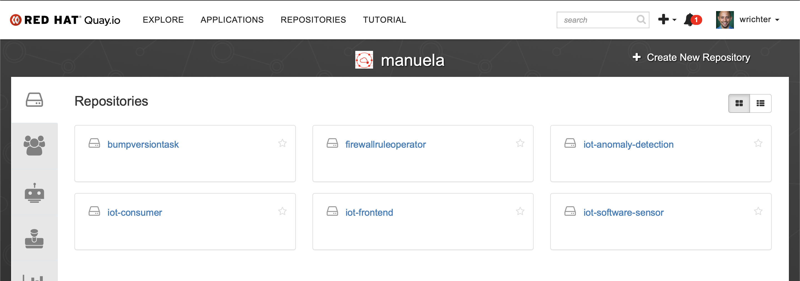
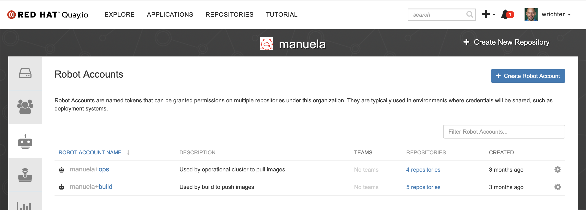
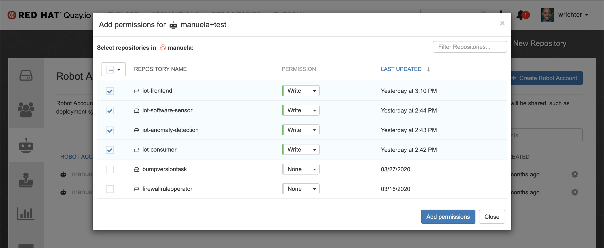
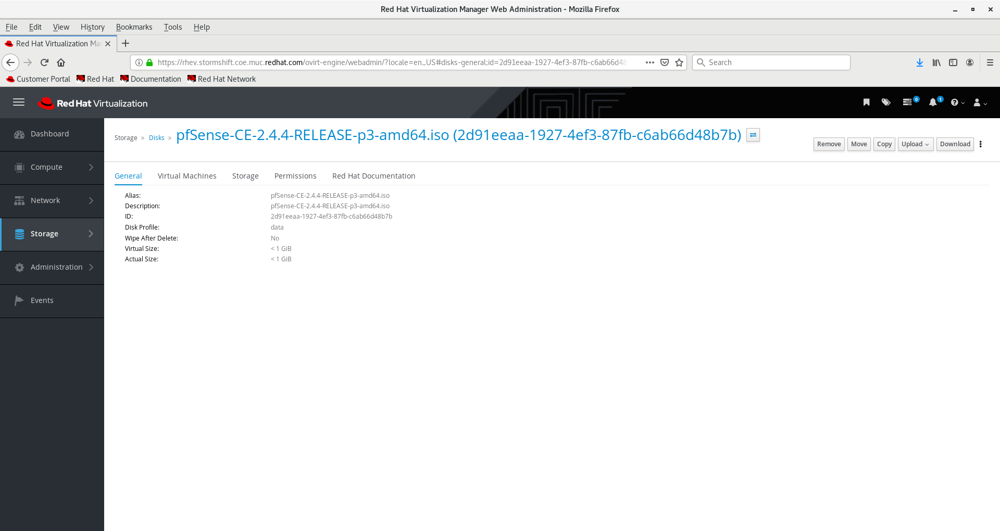
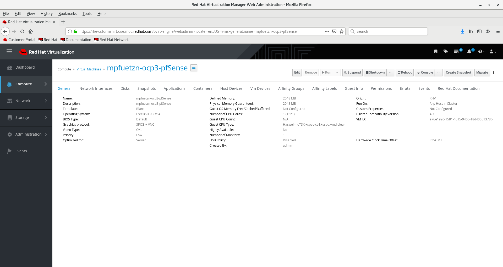
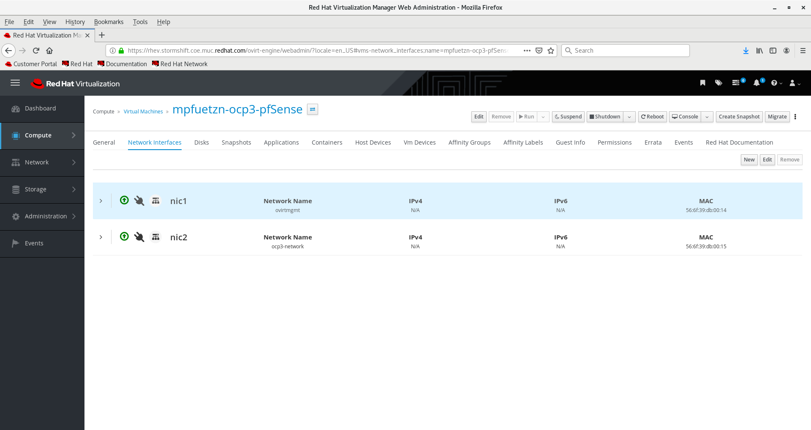
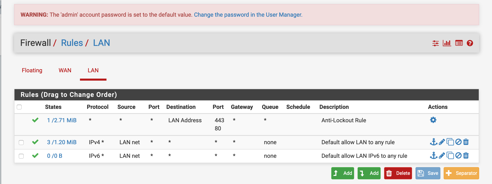
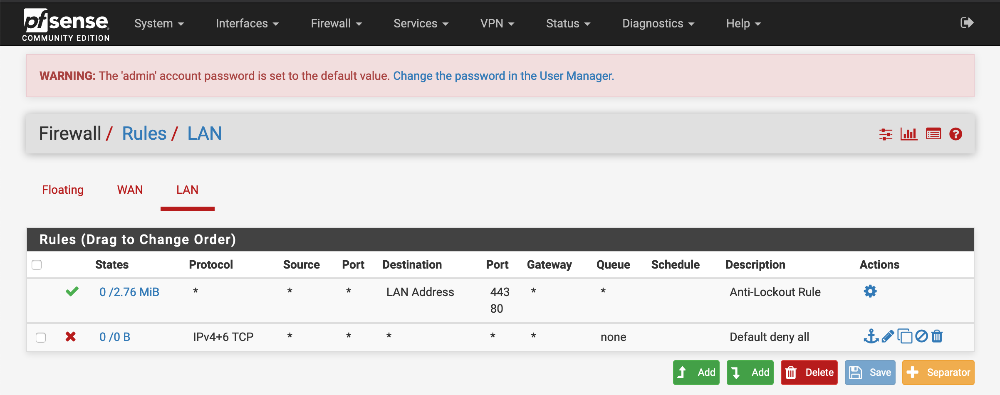

# Bootstrap <!-- omit in toc -->
This document describes how to bootstrap (install from scratch) the complete demo. This is separate from and in addition to the [quickstart](QUICKSTART.md) which describes a simplified setup and demo runthrough on a single cluster and the actual demo preparation and execution steps.

- [Prerequisites](#prerequisites)
  - [Logical Environments](#logical-environments)
  - [OpenShift clusters](#openshift-clusters)
  - [Github account](#github-account)
  - [Quay instance](#quay-instance)
  - [Virtualization environment (Optional)](#virtualization-environment-optional)
- [Planning your installation](#planning-your-installation)
- [Clone the manuela repository](#clone-the-manuela-repository)
- [Fork and clone manuela and manuela-dev](#fork-and-clone-manuela-and-manuela-dev)
- [Create the gitops repository](#create-the-gitops-repository)
  - [Option 1: You demo stormshift and use the existing github.com/sa-mw-dach/manuela-gitops](#option-1-you-demo-stormshift-and-use-the-existing-githubcomsa-mw-dachmanuela-gitops)
  - [Option 2: You set up a new environment and use a custom GitOps repository](#option-2-you-set-up-a-new-environment-and-use-a-custom-gitops-repository)
- [CI and Test (Mandatory)](#ci-and-test-mandatory)
  - [Create the namespaces and operators](#create-the-namespaces-and-operators)
  - [Instantiate ArgoCD](#instantiate-argocd)
    - [Create the cluster deployment agent configuration](#create-the-cluster-deployment-agent-configuration)
    - [Deploy the ArgoCD Cli Tool (optional)](#deploy-the-argocd-cli-tool-optional)
    - [Validate gitops repo via ArgoCD Web UI](#validate-gitops-repo-via-argocd-web-ui)
    - [Remove manuela-temp-amq namespace](#remove-manuela-temp-amq-namespace)
  - [Instantiate Tekton Pipelines](#instantiate-tekton-pipelines)
    - [Adjust secrets](#adjust-secrets)
    - [Adjust Config Map](#adjust-config-map)
    - [Instantiate Pipelines](#instantiate-pipelines)
  - [Seed the git ops repo and image registries](#seed-the-git-ops-repo-and-image-registries)
- [Factory Datacenter & Line Data Server (Mandatory)](#factory-datacenter--line-data-server-mandatory)
- [Optional extensions](#optional-extensions)
  - [Development (Optional)](#development-optional)
  - [CodeReady Workspaces (Optional)](#codeready-workspaces-optional)
  - [Management Cluster(s) and Firewall VM(s) (Optional)](#management-clusters-and-firewall-vms-optional)
    - [ArgoCD deployment agent configuration](#argocd-deployment-agent-configuration)
    - [Set Up pfSense Firewall VM](#set-up-pfsense-firewall-vm)
    - [Configure rules](#configure-rules)
    - [Set root ssh key](#set-root-ssh-key)
    - [Install & Prepare the firewall operator (once per firewall instance)](#install--prepare-the-firewall-operator-once-per-firewall-instance)
  - [Machine Learning based Anomaly Detection and Alerting (Optional)](#machine-learning-based-anomaly-detection-and-alerting-optional)
    - [Bootstrap and configure Anomaly Detection Service in manuela-tst-all](#bootstrap-and-configure-anomaly-detection-service-in-manuela-tst-all)
    - [Bootstrap and configure Anomaly Detection Service in production (manuela-stormshift-odh)](#bootstrap-and-configure-anomaly-detection-service-in-production-manuela-stormshift-odh)
    - [Bootstrap and configure Anomaly Detection Service in iotdemo on OCP3](#bootstrap-and-configure-anomaly-detection-service-in-iotdemo-on-ocp3)

## Prerequisites

### Logical Environments

This edge demo storyline spans multiple environments, from edge deployments over remote datacenters and central datacenters to public cloud environments. These logical environments can be mapped to a smaller number of physical environments. The following table gives an overview of the mapping in the stormshift environment:

Logical Environment Name|Status|Namespaces|Stormshift Mapping|Comments
---|---|---|---|---
Development|Optional|iotdemo|ocp3|Development environment, hosts e.g. AMQ Broker for IOT App Dev
CodeReady Workspaces|Optional|manuela-crw|ocp3|Development on-demand
CI/CD & Test|Mandatory|manuela-ci, manuela-tst-all|ocp3|All-in-one CI/CD and functional testing environment
Factory Datacenter|Mandatory|manuela-\*-line-dashboard, manuela-\*-messaging|ocp3|Production environment in Factory
Line Data Server|Mandatory|manuela-\*-machine-sensor|ocp4|Production environment in Factory, close to production line
Central Datacenter|Mandatory| - |quay.io|Production environment in central datacenter, hosts enterprise registry
Management Cluster|Optional|manuela-nwpathoperator|ocp3 + pfSense VM|Cluster hosting the firewall operator which controls the firewall between Line Data Server and Factory Datacenter

### OpenShift clusters

Two or more OpenShift clusters version 4.3 or later are installed and running. You have administrative access to these clusters. The instructions assume you are logged into the correct OpenShift cluster depending on the logical environment mapping (see above) for your demo setup. See [Planning your installation](#Planning-your-installation) for more details.

### Github account

The demo uses GitHub for the GitOps git workflow. You need a GitHub account that can access the chosen GitOps repository (see below) and have a [Personal Access Token](https://github.com/settings/) with "repo" permissions.

### Quay instance

This demo uses quay as the central registry. This can be quay.io or quay enterprise.

Create the repositories:
* iot-consumer
* iot-frontend
* iot-anomaly-detection
* iot-software-sensor



Also create a robot account "build".


Ensure the robot account has write permissions to the repositories.


Login to [https://quay.io/organization/manuela?tab=robots](https://quay.io/organization/manuela?tab=robots) and note the .dockerconfigjson from the robo account "manuela-build". You will need store it in a secret when setting up the [CI and Test (Mandatory)](#CI-and-Test-Mandatory).

### Virtualization environment (Optional)

If you intend to show the firewall operator, you need to run a pfSense firewall in a virtualization environment.
(We currently use Red Hat Enterprise Virtualization)

## Planning your installation

Some general tips to plan your installation:
* If you have clusters with different sizes, choose the largest to hold the CI/CD & Test environment.
* Code Ready Workspaces is also very resource intensive (~2 GB RAM per workspace), place it on the largest cluster as well.
* The Line Data Server environment only consists of ArgoCD and the two machine sensors which are fairly lightweight.

We suggest the following distributions:

* Two clusters:
  * Cluster 1: CRW, CI/CD & Test, Central Datacenter, Factory Datacenter
  * Cluster 2: Line Data Server 
* Three clusters:
  * Cluster 1: CRW, CI/CD & Test, Central Datacenter
  * Cluster 2: Factory Datacenter
  * Cluster 3: Line Data Server
* Four clusters:
  * Cluster 1: CRW, CI/CD & Test
  * Cluster 2: Central Datacenter
  * Cluster 3: Factory Datacenter
  * Cluster 4: Line Data Server

## Clone the manuela repository

Clone the manuela repository. You can choose a different directory, but the subsequent docs assume it to reside in ~/manuela .

```bash
cd ~
git clone https://github.com/sa-mw-dach/manuela.git
```

## Fork and clone manuela and manuela-dev

Unless you are using the stormshift environment, create a fork of https://github.com/sa-mw-dach/manuela-dev.git to your GitHub account. Each environment should have its own set of repositories, since running the demo will alter the manuela-dev contents during the coding demo and CI/CD runs.

Then, clone the your manuela-dev repository into your home directory. This repo contains everything required to set up the manuela demo. You can choose a different directory, but the subsequent docs assume it to reside in ~/manuela-dev .

```bash
cd ~
git clone https://github.com/<yourorg>/manuela-dev.git
```

## Create the gitops repository

Unless you are using the stormshift environment, create a new GitOps repository. You can choose a different name, but the subsequent docs assume it to reside in ~/manuela-gitops.

### Option 1: You demo stormshift and use the existing github.com/sa-mw-dach/manuela-gitops

```bash
cd ~
git clone https://github.com/sa-mw-dach/manuela-gitops.git
```

### Option 2: You set up a new environment and use a custom GitOps repository

Create your own GitOps repo from [https://github.com/sa-mw-dach/manuela-gitops-example](https://github.com/sa-mw-dach/manuela-gitops-example)
```bash
cd ~
git clone https://github.com/sa-mw-dach/manuela-gitops-example
mv manuela-gitops-example manuela-gitops
```

[Publish this new directory to Github](https://help.github.com/en/github/importing-your-projects-to-github/adding-an-existing-project-to-github-using-the-command-line) and note the GitHub URL.

```bash
git remote set-url origin https://github.com/<yourorg>/<yourrepo>.git
git push -u origin master
```

Adjust the GitOps repo to match your OCP clusters:
1. For each (physical) cluster, create a directory in ```~/manuela-gitops/deployment``` based on the sample directory. Ensure that the name of the placeholder configmap name is adjusted in each directory to match the cluster name.
2. If you intend to demonstrate the firewall operator, do the same for the network paths between the clusters.
3. In the directory representing the cluster which hosts the CI/CD and Test environment, leave the manuela-tst-all symlink and delete it in the other directories. Adjust the ```spec.source.repoURL``` value to match the gitops repo url.
4. For each (physical) cluster and for each network path between them, create an ArgoCD application in ```~/manuela-gitops/meta``` based on the sample. Remember to adjust it's ```metadata.name``` to match the cluster name, ```spec.source.repoURL``` to point to the GitHub URL and ```spec.source.path``` to point to the directory representing the cluster/networkpath in ```~/manuela-gitops/deployment```.
5. Adjust the application configuration of the ```line-dashboard-configmap-config.json``` in ```~/manuela-gitops/config/instances/manuela-tst/``` and ```~/manuela-gitops/config/instances/manuela-prod``` to match your environment:
   - Messaging URL for the machine-sensors
   - Messaging URL for the line-dashboard

Push the changes to GitHub:
```bash
cd ~/manuela-gitops
git add .
git commit -m "adopted to match demo env"
git push
```

## CI and Test (Mandatory)
### Create the namespaces and operators

```bash
cd ~/manuela
oc apply -k namespaces_and_operator_subscriptions/openshift-pipelines
oc apply -k namespaces_and_operator_subscriptions/manuela-ci
oc apply -k namespaces_and_operator_subscriptions/argocd
oc apply -k namespaces_and_operator_subscriptions/manuela-temp-amq
```

### Instantiate ArgoCD

Wait for the ArgoCD operator to be available
```bash
oc get pods -n argocd

NAME                                             READY   STATUS              RESTARTS   AGE
argocd-operator-65dcf99d75-htjq4                 1/1     Running             0          114s
```

Then instantiate ArgoCD and allow its service account to manage the cluster
```bash
oc apply -k infrastructure/argocd
oc adm policy add-cluster-role-to-user cluster-admin -n argocd -z argocd-application-controller
```

Wait for the argocd resources to be created
```bash
oc get secret argocd-secret -n argocd

NAME            TYPE     DATA   AGE
argocd-secret   Opaque   2      2m12s
```

Set the ArgoCD admin password to admin/admin
```bash
oc -n argocd patch secret argocd-secret  -p '{"stringData": { "admin.password": "'$(htpasswd -nbBC 10 admin admin | awk '{print substr($0,7)}')'", "admin.passwordMtime": "'$(date +%FT%T%Z)'" }}'
```

Check pods and routes to validate ArgoCD is running
```bash
oc get pods -n argocd

NAME                                             READY   STATUS    RESTARTS   AGE
argocd-application-controller-7b96cb74dd-lst94   1/1     Running   0          12m
argocd-dex-server-58f5b5b44f-cfsw5               1/1     Running   0          12m
argocd-redis-868b8cb57f-dc6fl                    1/1     Running   0          12m
argocd-repo-server-5bf79d67f4-hvnwx              1/1     Running   0          12m
argocd-server-888f8b6b8-scvll                    1/1     Running   0          7m16s

oc get routes

NAME            HOST/PORT                               PATH   SERVICES        PORT   TERMINATION     WILDCARD
argocd-server   argocd-server-argocd.apps-crc.testing          argocd-server   http   edge/Redirect   None
```

#### Create the cluster deployment agent configuration

This also causes the manuela-tst-all testing project to be deployed via ArgocCD
```bash
oc create -n argocd -f ~/manuela-gitops/meta/argocd-<yourphysicalcluster>.yaml
```

#### Deploy the ArgoCD Cli Tool (optional)

Download the ArgoCD binary, place it under /usr/local/bin and give it execution permissions
```bash
sudo curl -L https://github.com/argoproj/argo-cd/releases/download/v1.4.1/argocd-linux-amd64 -o /usr/local/bin/argocd
sudo chmod +x /usr/local/bin/argocd
```
Now you should be able to use the ArgoCD WebUI and the ArgoCD Cli tool to interact with the ArgoCD Server.

#### Validate gitops repo via ArgoCD Web UI

Log in via OpenShift authentication (or use user: admin, password: admin) and validate that at least the cluster deployment agent configuration and manuela-tst-all is present.

To get the ArgoCD URL use:
```bash
echo https://$(oc -n argocd get route argocd-server -o jsonpath='{.spec.host}')
```

#### Remove manuela-temp-amq namespace

This namespace was created to kickstart the ArgoCD deployment of manuela-tst-all by making the AMQ Broker CRD known to the cluster. It can now be removed:
```bash
oc delete -k namespaces_and_operator_subscriptions/manuela-temp-amq
```

### Instantiate Tekton Pipelines

#### Adjust secrets
Adjust Tekton secrets to match your environments.

GitHub Secret:
```bash
cd ~/manuela-dev
export GITHUB_PERSONAL_ACCESS_TOKEN=changeme
sed "s/token: cmVwbGFjZW1l/token: $(echo -n $GITHUB_PERSONAL_ACCESS_TOKEN|base64)/" tekton/secrets/github-example.yaml >tekton/secrets/github.yaml
```
```bash
cd ~/manuela-dev
export GITHUB_USER=changeme
sed "s/user: cmVwbGFjZW1l/user: $(echo -n $GITHUB_USER|base64)/" tekton/secrets/github-example.yaml >tekton/secrets/github.yaml
```

ArgoCD Secret:
```bash
sed "s/ARGOCD_PASSWORD:.*/ARGOCD_PASSWORD: $(oc get secret argocd-cluster -n argocd -o jsonpath='{.data.*}')/" tekton/secrets/argocd-env-secret-example.yaml >tekton/secrets/argocd-env-secret.yaml
```

Quay Build Secret:
```bash
export QUAY_BUILD_SECRET=ewogICJhdXRocyI6IHsKICAgICJxdWF5LmlvIjogewogICAgICAiYXV0aCI6ICJiV0Z1ZFdWc1lTdGlkV2xzWkRwSFUwczBRVGMzVXpjM1ZFRlpUMVpGVGxWVU9GUTNWRWRVUlZOYU0wSlZSRk5NUVU5VVNWWlhVVlZNUkU1TVNFSTVOVlpLTmpsQk1WTlZPVlpSTVVKTyIsCiAgICAgICJlbWFpbCI6ICIiCiAgICB9CiAgfQp9
sed "s/\.dockerconfigjson:.*/.dockerconfigjson: $QUAY_BUILD_SECRET/" tekton/secrets/quay-build-secret-example.yaml >tekton/secrets/quay-build-secret.yaml
```

#### Adjust Config Map
Adjust Tekton environment config map to match your environment. Unless you are deviating from the manuela-gitops repository structure and contents, you only need to change the values which begin with GIT_ or end with _REMOTE_IMAGE.

#### Instantiate Pipelines
Then instantiate the pipelines
```bash
cd ~/manuela-dev
oc apply -k tekton/secrets
oc apply -k tekton
```

### Seed the git ops repo and image registries

In order to ensure that the container repositories, the manuela-tst-all namespace and the production environment have a working configuration to base demo runs on, run the seed pipeline to populate them: 

```bash
oc process -n manuela-ci seed | oc create -n manuela-ci -f -
```

Wait for the pipeline to complete successfully.

## Factory Datacenter & Line Data Server (Mandatory)
For the individual physical clusters representing the factory datacenter and the line data server, ensure that ArgoCD is deployed and allowed to manage the cluster. If you have already done this as part of the setup of another logical environment, you may skip this step.
```bash
cd ~/manuela
oc apply -k namespaces_and_operator_subscriptions/argocd
oc apply -k infrastructure/argocd
```
Then, clone the your manuela-dev repository into your home directory. This repo contains everything required to set up the manuela demo. You can choose a different directory, but the subsequent docs assume it to reside in ~/manuela-dev . for the respective cluster is present
```bash
oc apply -n argocd -f ~/manuela-gitops/meta/argocd-<yourphysicalcluster>
```

Refer to [Validate GitOps repository via ArgoCD Web UI](#validate-gitops-repo-via-argocd-web-ui) to validate the ArgoCD setup.

On the physical cluster representing the factory datacenter, ensure that the AMQ Broker CRD is instantiated, so that a rollout of a project containing the AMQ Broker CR will not fail via ArgoCD. If this hasn't happened as part of other steps, do the following:
```bash
oc apply -k namespaces_and_operator_subscriptions/manuela-temp-amq
```

Then wait a little, then
```bash
oc delete -k namespaces_and_operator_subscriptions/manuela-temp-amq
```

## Optional extensions

### Development (Optional)
You only need to install this if you intend to develop the demo application. This will provide you with an AMQ Broker and configurations to build and deploy the container images in the iotdemo namespace.

Adjust the ```~/manuela-dev/components/iot-frontend/manifests/iot-frontend-configmap-config.json``` to the target environment (Note: the software sensor components uses the internal service name to reach the AMQ broker, and therefore do not need adjustments):
```diff
{
-  "websocketHost": "http://iot-consumer-iotdemo.apps.ocp4.stormshift.coe.muc.redhat.com",
+  "websocketHost": "http://iot-consumer-iotdemo.apps.ocp3.stormshift.coe.muc.redhat.com",
  "websocketPath": "/api/service-web/socket",
  "SERVER_TIMEOUT": 20000
}
```

Instantiate the development environment. Note: this will kick off a build of all components which will take several minutes.
```bash
cd ~/manuela
oc apply -k namespaces_and_operator_subscriptions/iotdemo

oc project iotdemo

cd ~/manuela-dev
oc apply -k components
```

### CodeReady Workspaces (Optional)
If you want to demo the code change story line using CodeReady Workspaces instead of a local dev environment (or a simple git commit/push), you need to setup Code Ready Workspaces.

This provides CodeReady Workspaces as alternative development environment
```bash
cd ~/manuela
oc apply -k namespaces_and_operator_subscriptions/manuela-crw
oc apply -k infrastructure/crw
```

This will create the following:

1. Create a new project manuela-crw in the current logged in OCP
2. Create an OperatorGroup CR to make the OLM aware of an operator in this namespace
3. Create an CRW Operator Subscription from the latest stable channel -> installs the CRW operator in the namespace manuela-crw
4. Create an actual CheCluster in the namespace manuela-crw with following custom properties
```yaml
customCheProperties:
  CHE_LIMITS_USER_WORKSPACES_RUN_COUNT: '10'
  CHE_LIMITS_WORKSPACE_IDLE_TIMEOUT: '-1'
```

CRW should be available after about 3-5 minutes after the previous installation steps.
1. Check and wait that the pods are online:
    ```bash
    oc project manuela-crw
    oc get pods
    NAME                                  READY   STATUS    RESTARTS   AGE
    codeready-7898fc5f74-qz7bk            1/1     Running   0          4m59s
    codeready-operator-679f5fbd6b-ldsbq   1/1     Running   0          8m2s
    devfile-registry-58cbd6787f-zdfhb     1/1     Running   0          6m11s
    keycloak-567744bfd6-dx2hs             1/1     Running   0          7m15s
    plugin-registry-6974f58d59-vh5hc      1/1     Running   0          5m43s
    postgres-55ccbdccb-cnnbc              1/1     Running   0          7m48s
    ```

2. Check that you can login. Look for the route with the name **codeready:**
```bash
echo https://$(oc -n manuela-crw get route codeready -o jsonpath='{.spec.host}')
```
Point your browser to the URL and  use your OpenShift Account (OpenShift OAuth is enabled) to login.  
***Bookmark that URL !***

### Management Cluster(s) and Firewall VM(s) (Optional)

#### ArgoCD deployment agent configuration

Ensure that ArgoCD is running on and able to manage the management cluster(s). See the instructions for the [Factory Datacenter & Line Data Server](#factory-datacenter--line-data-server-mandatory) for details. Create the deployment agent configuration:
```bash
cd ~/manuela-gitops/meta/
oc apply -n argocd -f argocd-nwpath-<cluster1>-<cluster2>.yaml
```

#### Set Up pfSense Firewall VM

Download pfSense ISO (CD/DVD) image from [https://www.pfsense.org/download/](https://www.pfsense.org/download/) and upload the ISO image to your virtualization environment, e.g. [https://rhev.stormshift.coe.muc.redhat.com/](https://rhev.stormshift.coe.muc.redhat.com/).



Create 2 new VMs (mpfuetzn-ocp3-pfsense and mpfuetzn-ocp4-pfsense) as follows:



Add Network Interfaces. Nic1 (LAN) needs to be in a routable network reachable from the management cluster, such as ovirtmgmt for RHV. For example:



(replace ocp3 for ocp4 in the second machine!)

Attach the CD-ISO image to the VM to boot from for the first time

After install, and after the first reboot (do not forget to remove the CD-ISO Image!) configure as follows:
* NO VLANS
* WAN interface is vtnet1 (aka the ocp3-network)
* LAN interface is vtnet0 (aka the ovirtmgt network)
* LAN now also needs a fix IP and a router: ocp3 has 10.32.111.165/20 as IP and 10.32.111.254 as router, ocp4 has 10.32.111.166/20 as ip and the same router
* WAN gets its IP via DHCP in the range of 172.16.10.???/24

Default password for the appliances is admin/pfsense

#### Configure rules

The default rules configured might not be suitable to the story being told, i.e. a locked down environment. Per default, all IP4/6 traffic is allowed from LAN to WAN. 



Replace these rules with a "Default deny all" rule blocking IP4+6.




#### Set root ssh key

For the demo ssh-access needs to additionally be enabled and keys generated, because the operator needs to be able to access the pfsense appliance via Ansible. Generate a keypair which will be used to access the demo
```
$ ssh-keygen -f keypair

Generating public/private rsa key pair.
Enter passphrase (empty for no passphrase):
Enter same passphrase again:
Your identification has been saved in keypair.
Your public key has been saved in keypair.pub.
The key fingerprint is:
SHA256:e2hUI5thMlfnCCpLW3gS1ClipfGywPYY391+SrO8xx4 vagrant@ibm-p8-kvm-03-guest-02.virt.pnr.lab.eng.rdu2.redhat.com
The key's randomart image is:
+---[RSA 2048]----+
|  .o+. .. . .    |
|. o+.oo. o +     |
|.=o.*.* = + .    |
|..=+.B.=.* .     |
| ..oo. .S.       |
|       ..o       |
|        ++oE     |
|       .o.=o.    |
|         =+.     |
+----[SHA256]-----+

$ cat keypair.pub
ssh-rsa AAAAB3NzaC1yc2EAAAADAQABAAABAQCw5CP4Sj1qp6cLb2Bp6grN59qOUuBrOfz7mc12848TP+PyLtS8KL6GBpb0ySOzEMIJdxhiZNHLiSLzh7mtHH0YXTdErdjD2hK9SOt9OmJrys8po9BLhVvacdRDS0l2BFyxG7gaCU92ZmTJHKtLi2jpOLMFNXl5oSva0u5WL+iYQJhgBCezxCSKhUquxLL9Ua9NThkhb064xzm7Vw0Qx53VY89O6dOX7MFeLM19YT1jfLDJ0CGWNju3dyFbQNNmn/ZquP91DFeV9mTS2lP/H+bd20osDScEzE+c3zeDsP8UmLbOhBsQs6kRXLos58Ag3vjCommULfPnHvTFbgVKbwnh [vagrant@ibm-p8-kvm-03-guest-02.virt.pnr.lab.eng.rdu2.redhat.com](mailto:vagrant@ibm-p8-kvm-03-guest-02.virt.pnr.lab.eng.rdu2.redhat.com)
```
Log into pfsense firewall with default username/pw
```
$ ssh root@10.32.111.165

The authenticity of host '10.32.111.165 (10.32.111.165)' can't be established.
ED25519 key fingerprint is SHA256:ZoXQTnMit+NaHMvQbfTPT3/ztn+xkUB7BrVSptxjBvg.
Are you sure you want to continue connecting (yes/no)? yes
Warning: Permanently added '10.32.111.165' (ED25519) to the list of known hosts.
Password for root@pfSense.localdomain:

pfSense - Netgate Device ID: 445f648407f99eee6675

*** Welcome to pfSense 2.4.4-RELEASE-p3 (amd64) on pfSense ***
 WAN (wan)       -> vtnet1     -> v4/DHCP4: 172.16.10.102/24
 LAN (lan)       -> vtnet0     -> v4: 10.32.111.165/20
 1) Logout (SSH only)                  9) pfTop
 2) Assign Interfaces                 10) Filter Logs
 3) Set interface(s) IP address       11) Restart webConfigurator
 4) Reset webConfigurator password    12) PHP shell + pfSense tools
 5) Reset to factory defaults         13) Update from console
 6) Reboot system                     14) Disable Secure Shell (sshd)
 7) Halt system                       15) Restore recent configuration
 8) Ping host                         16) Restart PHP-FPM
 9) Shell
Enter an option: **8**

[2.4.4-RELEASE][root@pfSense.localdomain]/root: cat >>.ssh/authorized_keys

ssh-rsa AAAAB3NzaC1yc2EAAAADAQABAAABAQCw5CP4Sj1qp6cLb2Bp6grN59qOUuBrOfz7mc12848TP+PyLtS8KL6GBpb0ySOzEMIJdxhiZNHLiSLzh7mtHH0YXTdErdjD2hK9SOt9OmJrys8po9BLhVvacdRDS0l2BFyxG7gaCU92ZmTJHKtLi2jpOLMFNXl5oSva0u5WL+iYQJhgBCezxCSKhUquxLL9Ua9NThkhb064xzm7Vw0Qx53VY89O6dOX7MFeLM19YT1jfLDJ0CGWNju3dyFbQNNmn/ZquP91DFeV9mTS2lP/H+bd20osDScEzE+c3zeDsP8UmLbOhBsQs6kRXLos58Ag3vjCommULfPnHvTFbgVKbwnh vagrant@ibm-p8-kvm-03-guest-02.virt.pnr.lab.eng.rdu2.redhat.com**

[2.4.4-RELEASE][root@pfSense.localdomain]/root: exit

exit

pfSense - Netgate Device ID: 445f648407f99eee6675

*** Welcome to pfSense 2.4.4-RELEASE-p3 (amd64) on pfSense ***
 WAN (wan)       -> vtnet1     -> v4/DHCP4: 172.16.10.102/24
 LAN (lan)       -> vtnet0     -> v4: 10.32.111.165/20
 0) Logout (SSH only)                  9) pfTop
 1) Assign Interfaces                 10) Filter Logs
 2) Set interface(s) IP address       11) Restart webConfigurator
 3) Reset webConfigurator password    12) PHP shell + pfSense tools
 4) Reset to factory defaults         13) Update from console
 5) Reboot system                     14) Disable Secure Shell (sshd)
 6) Halt system                       15) Restore recent configuration
 7) Ping host                         16) Restart PHP-FPM
 8) Shell
Enter an option: **^D**
Connection to 10.32.111.165 closed.
```
#### Install & Prepare the firewall operator (once per firewall instance)

Each firewall instance is represented by a namespace in the management cluster. These namespaces have to match the namespaces in the ```~/manuela-gitops/meta/argocd-nwpath-<cluster1>-<cluster2>.yaml``` files. Create the namespace via oc command. Replace manuela-networkpathoperator with your chosen namespace in the subsequent command examples
```bash
oc new-project manuela-networkpathoperator
```

Prepare a secret for the operator deployment. Adjust hostname, username, SSH private key for firewall access as created before
```bash
cd ~/manuela-dev/networkpathoperator/firewallrule/deploy
cp firewall-inventory-secret-example.yaml firewall-inventory-secret.yaml
vi firewall-inventory-secret.yaml
```

Deploy the operator to the new namespace
```bash
cd ~/manuela-dev
oc project manuela-networkpathoperator
oc apply -n manuela-networkpathoperator -f networkpathoperator/firewallrule/deploy/firewall-inventory-secret.yaml
oc apply -k networkpathoperator/firewallrule/deploy
```

Test the sample firewall rule
```bash
oc apply -n manuela-networkpathoperator -f deploy/crds/manuela.redhat.com_v1alpha1_firewallrule_cr.yaml
```

Validate that the firewall rule in deploy/crds/manuela.redhat.com_v1alpha1_firewallrule_cr.yaml is created appropriately in the firewall **(via firewall UI)**. Then remove the firewall rule
```bash
oc delete -n manuela-networkpathoperator -f deploy/crds/manuela.redhat.com_v1alpha1_firewallrule_cr.yaml
```

Validate that the firewall rule in deploy/crds/manuela.redhat.com_v1alpha1_firewallrule_cr.yaml is removed appropriately from the firewall **(via firewall UI)**.


### Machine Learning based Anomaly Detection and Alerting (Optional)

Machine Learning based alerting is not enabled by default in the iotdemo and stormshift (test & prod) environment. The following section describes how to enable and disable the Machine Learning based Anomaly Detection and Alerting for iotdemo and stormshift (test & prod) environment.

Note, the steps how to deploy an OpenDataHub with JupyterHub is described in the [Demo Preparation](./module-machine-learning.md#Prerequisites ) 

**Let's look at the Stormshift test & prod first**


Please clone the  ```manuela-gitops```  and ```manuela``` repos  into your home directory.  You can choose a different directory, but the subsequent docs assume it to reside in ```~/manuela-gitops```  and ```~/manuela``` .


#### Bootstrap and configure Anomaly Detection Service in manuela-tst-all

login into ocp3 as admin or with admin privileges and switch to the manuela-tst-all project
```
oc login -u XXX -p XXXX --server=https://api.ocp3.stormshift.coe.muc.redhat.com:6443


oc project manuela-tst-all
```


_**Install Seldon CRD**_ 

Check if the SeldonCore Operator is deployed:

```
oc get csv -n manuela-tst-all | grep -i seldon

```

Expected results:
```
seldon-operator.v1.2.0                Seldon Operator                    1.2.0                  Succeeded
```

If not, deploy the SeldonCore Operator
```
oc apply -k ~/manuela/namespaces_and_operator_subscriptions/seldon-operator/manuela-tst-all/

```


_**Build iot-anomaly-detection container by running the pipeline**_ 


Check if the anomaly-detection image stream already exists:

```
oc get is anomaly-detection -n manuela-tst-all

```

Expected results:
```
NAME                IMAGE REPOSITORY                                                                                                   TAGS      UPDATED
anomaly-detection   default-route-openshift-image-registry.apps.ocp3.stormshift.coe.muc.redhat.com/manuela-tst-all/anomaly-detection   0.0.1-7   8 minutes ago
```

If not, run the pipeline to build the anomaly-detection image.

_**Enable ODH and Seldon service**_ 

Edit ```~/manuela-gitops/config/instances/manuela-tst/kustomization.yaml```
and uncomment the line  ```../../templates/manuela-openshift/anomaly-detection```

For example ... 

 ```
 ...
# Comment out the following line if you don't want to run anomaly-detection (ODH)
- ../../templates/manuela-openshift/anomaly-detection
...
```

Push changes to master. ArgoCD will pickup the change.


_**Test the anomaly detection service**_ 

```
curl -k -X POST -H 'Content-Type: application/json' -d '{"data": { "ndarray": [[16.1,  15.40,  15.32,  13.47,  17.70]]}}' http://$(oc get route anomaly-detection -o jsonpath='{.spec.host}' -n manuela-tst-all)/api/v1.0/predictions
```

Expexted result:
```
{"data":{"names":[],"ndarray":[1]},"meta":{}}
```


_**Enable the vibration alert and vibration anomaly detection in the messaging-configmap**_ 

Update the messaging config map:  

In ```~/manuela-gitops/config/instances/manuela-tst/messaging/messaging-configmap.properties``` set 
```properties
VIBRATION_ALERT_ENABLED=true
VIBRATION_ANOMALY_ENABLED=true
``` 


```
cd ~/manuela-gitops/

sed -i "s|VIBRATION_ANOMALY_ENABLED.*|VIBRATION_ANOMALY_ENABLED=true|" config/instances/manuela-tst/messaging-configmap.properties

sed -i "s|VIBRATION_ALERT_ENABLED.*|VIBRATION_ALERT_ENABLED=true|" config/instances/manuela-tst/messaging-configmap.properties

git add .
git commit -m "enable vibration anomaly alert"
git push
```
Push the changes to github and wait that ArgoCD picks up the change. This should automatically redeploy the pods since the generated configmap name changed.

Check the messaging log to see if Anomaly web service is called.

```
oc logs -f deployment/messaging -n manuela-tst-all
```

You can also check the log of the anomaly-detection-predictor:

```
oc logs -f anomaly-detection-predictor-XXXXX -c anomaly-detection -n manuela-tst-all
```
Expected log:
```
Anomaly detection for: floor-1-line-1-extruder-1pump-2, Val: 10.448725266151287
*AD* ID: floor-1-line-1-extruder-1pump-2,  Val: 10.448725266151287
vibration alert!!!
```

Expected log:
```
2020-04-30 08:49:08,702 - werkzeug:_log:113 - INFO:  127.0.0.1 - - [30/Apr/2020 08:49:08] "POST /predict HTTP/1.1" 200 -
 Predict features:  [[17.45270494 16.18148444 15.33149548 37.02017565 14.3998071 ]]
Prediction:  [0]
2020-04-30 08:49:08,784 - werkzeug:_log:113 - INFO:  127.0.0.1 - - [30/Apr/2020 08:49:08] "POST /predict HTTP/1.1" 200 -
 Predict features:  [[10.44872527 11.30054612 13.24766808 14.47263542 40.36102793]]
Prediction:  [1]
```

#### Bootstrap and configure Anomaly Detection Service in production (manuela-stormshift-odh)

Prerequitsites: 
- Anomaly Detection Service is deployed in manuela-tst-all
- Pipeline iot-anomaly-detection run successfully


_**Enable ODH and Seldon service**_

Let's assume you cloned the manuela-gitops repository already.

Create a symbolic link to instruct AgroCD to deploy opendatahub.

```
cd   ~/manuela-gitops/deployment/execenv-ocp3

ln -s ../../config/instances/manuela-stormshift/manuela-stormshift-opendatahub-application.yaml
```


_**Enable Vibration Alert and Vibration Anomaly detection in messaging-configmap of manuela-stormshift**_


Update the messaging config map:  

Edit  ``` ~/manuela-gitops/config/instances/manuela-stormshift/messaging/messaging-configmap.properties``` and set the following paramters:

```properties
...
ANOMALY_DETECTION_URL=https://anomaly-detection-manuela-stormshift-odh.apps.ocp3.stormshift.coe.muc.redhat.com
VIBRATION_ALERT_ENABLED=true
VIBRATION_ANOMALY_ENABLED=true
NODE_TLS_REJECT_UNAUTHORIZED=0
...
```
Push the changes to github and wait that ArgoCD picks up the change.

Then, restart the messaging pod:

```
oc delete  pods -l  app=messaging -n manuela-stormshift-messaging 
```

Check the messaging log to see if Anomaly web service is called (see above).

#### Bootstrap and configure Anomaly Detection Service in iotdemo on OCP3

- TBD
