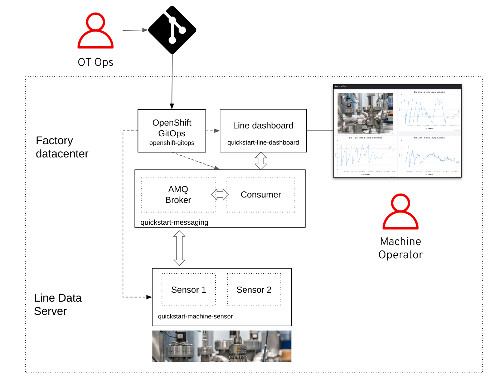

# Quick start and first steps <!-- omit in toc -->

By following these steps you will create your own instance of the manuela gitops repository and use it to deploy and configure an application via GitOps to a single OpenShift cluster.

- [Prequisites](#prequisites)
- [Quickstart deployment](#quickstart-deployment)
- [Prepare your own instance of the gitops repository](#prepare-your-own-instance-of-the-gitops-repository)
- [Deploy the OpenShift GitOps (ArgoCD) Operator](#deploy-the-openshift-gitops-argocd-operator)
- [Deploy the Applications via GitOps](#deploy-the-applications-via-gitops)
  - [Install the messaging component inclusive the AMQ Broker Operator and instance](#install-the-messaging-component-inclusive-the-amq-broker-operator-and-instance)
  - [Install the line dashboard component](#install-the-line-dashboard-component)
  - [Install the Senor Simulators components](#install-the-senor-simulators-components)
- [Configure the Sensors via GitOps](#configure-the-application-via-gitops)

## Prequisites

- **Local Workstation**: You have the ```git``` and ```oc``` command line clients installed
- **OpenShift Cluster**: You are logged into your cluster as cluster admin in via the ```oc``` command line client
- **GitHub Account**: You are logged into GitHub and can fork public repositories

## Quickstart deployment

This deployment is a minimal configuration for a simple showcase. It covers the following basic demo sceanrios:

1. GitOps based deploment all componenets
2. MQTT messaging with AMQ
3. Configuration sensors with GitOps





## Prepare your own instance of the gitops repository

Fork [https://github.com/sa-mw-dach/manuela-gitops.git](https://github.com/sa-mw-dach/manuela-gitops.git) into your own GitHub organisation (you will need to make changes in this repo).

Clone the forked repo to your local home directory (you can chose a different base directory and repo name, but this document assumes the repo is present under ~/manuela-gitops):
```bash
cd ~

git clone https://github.com/<organisation>/manuela-gitops.git
```

Configure ArgoCD applications to point to your forked gitops repo. Note: on OSX, the sed syntax is slightly different, you need to add an extra quotation marks after the -i: ```sed -i "" "s|....```.

```bash
cd ~/manuela-gitops

REPOURL=$(git remote get-url origin | sed "s|git@github.com:|https://github.com/|")

sed -i "s|repoURL:.*|repoURL: $REPOURL|" meta/argocd-quickstart.yaml \
  config/instances/manuela-quickstart/manuela-quickstart-line-dashboard-application.yaml \
  config/instances/manuela-quickstart/manuela-quickstart-messaging-application.yaml \
  config/instances/manuela-quickstart/manuela-quickstart-machine-sensor-application.yaml

git add .

git commit -m "adapt repo URLs"

git push
```

If you are NOT using CRC, adapt the gitops configuration to match your environment's base URL:
```
export OCP_WILDCARD_DOMAIN=apps.my.openshift.cluster.com

cd ~/manuela-gitops/config/instances/manuela-quickstart

sed -i  "s|apps-crc.testing|$OCP_WILDCARD_DOMAIN|" line-dashboard/line-dashboard-configmap-config.json \
  line-dashboard/line-dashboard-route.yaml machine-sensor/machine-sensor-1-configmap.properties \
  machine-sensor/machine-sensor-2-configmap.properties messaging/route.yaml

git add .

git commit -m "adapt base DNS names"

git push

cd ~/manuela-gitops
```

## Deploy the OpenShift GitOps (ArgoCD) Operator

Installing the OpenShift GitOps Operator is a manual step in this quickstart guide.

Follow the OpenShift Documentation. I.e. [Installing OpenShift GitOps Operator in web console](https://docs.openshift.com/container-platform/4.10/cicd/gitops/installing-openshift-gitops.html#installing-gitops-operator-in-web-console_installing-openshift-gitops) 

Please select:
- Latest update channel
- Installation mode: All namespaces
- Installed Namespaces: openshift-operators
- Update approval: Automatic 


Wait until the OpenShift GitOps operator is installed. This might take a short while. 

After the Red Hat OpenShift GitOps Operator is installed, it automatically sets up a ready-to-use Argo CD instance that is available in the openshift-gitops namespace, and an Argo CD icon is displayed in the console toolbar. 


After the installation is complete, ensure that all the pods in the openshift-gitops namespace are running:
```
oc get pods -n openshift-gitops

```
Example output:
```
NAME                                                      	READY   STATUS	RESTARTS   AGE
cluster-b5798d6f9-zr576                                   	1/1 	Running   0      	65m
kam-69866d7c48-8nsjv                                      	1/1 	Running   0      	65m
openshift-gitops-application-controller-0                 	1/1 	Running   0      	53m
openshift-gitops-applicationset-controller-6447b8dfdd-5ckgh 1/1 	Running   0      	65m
openshift-gitops-redis-74bd8d7d96-49bjf                   	1/1 	Running   0      	65m
openshift-gitops-repo-server-c999f75d5-l4rsg              	1/1 	Running   0      	65m
openshift-gitops-server-5785f7668b-wj57t                  	1/1 	Running   0      	53m
```


Note, in this quickstart deployment, we will use the cluster Argo CD instance and won't deploy any Manuela specific Argo CD instance.


Check that you can login into the Argo CD instance by using the Argo CD admin account:
- Follow the instructions in the documentation: [Logging in to the Argo CD instance by using the Argo CD admin account](https://docs.openshift.com/container-platform/4.10/cicd/gitops/installing-openshift-gitops.html#logging-in-to-the-argo-cd-instance-by-using-the-argo-cd-admin-account_installing-openshift-gitops)
- Or, pull the `admin` password with 
  
```
oc get secret openshift-gitops-cluster -o 'go-template={{index .data "admin.password"}}' -n openshift-gitops |  base64 -d
```

The admin credentials are needed because the manual sync runs into problems, when you login into ArgoCD with an OpenShift user.  


## Deploy the Applications via GitOps

We will deploy the three part of the core Manuele Applicatoion step by step:

1. Messaging component inclusive the AMQ Broker Operator and instance
2. Line Dashboard
3. Senor Simulators 

### Install the messaging component inclusive the AMQ Broker Operator and instance

Deploy the Messaging component:

```
$ oc apply -f config/instances/manuela-quickstart/manuela-quickstart-messaging-application.yaml
```
Example output:
```
application.argoproj.io/manuela-quickstart-messaging created
```

Check the status:
```
$ oc get application -n openshift-gitops
```
Example output:
```
NAME                                SYNC STATUS   HEALTH STATUS
manuela-quickstart-messaging        Synced        Progressing

```

Use the Argo CD UI to follow the installation.

You might run into issues with the AMQ operator installation when this guide a a bit outdated. Check with the OpenShift Administrator Console, if the update chancel, that is defined in `config/templates/manuela/messaging/amq-operator-subscription.yaml` is still available for the AMQ operator.


### Install the line dashboard component 

Deploy the line dashboard component

```
$ oc apply -f config/instances/manuela-quickstart/manuela-quickstart-line-dashboard-application.yaml
```
Example output:
``` 
application.argoproj.io/manuela-quickstart-line-dashboard created

```

Check the status:
```
$ oc get application -n openshift-gitops
```
Example output:
```
NAME                                SYNC STATUS   HEALTH STATUS
manuela-quickstart-line-dashboard   Synced        Progressing
manuela-quickstart-messaging        Synced        Healthy
```

Wait until the application is `Healthy`.


Open the Manuela line dashboard web application and view the sensor data by selecting the "Realtime Data" menu item. Retrieve the UI URL via:
```bash
echo http://$(oc -n manuela-quickstart-line-dashboard get route line-dashboard -o jsonpath='{.spec.host}')/sensors
```

Note, no sensor data is displayed , because the senor simulators are not deployed yet.

### Install the Senor Simulators components 

Deploy the line machine sensor application:

```
$ oc apply -f config/instances/manuela-quickstart/manuela-quickstart-machine-sensor-application.yaml
```
Example output:
``` 
application.argoproj.io/manuela-quickstart-machine-sensor created
```

Wait until the application is `Healthy`.

```
$ oc get application -n openshift-gitops
```
Example output:
```
NAME                                SYNC STATUS   HEALTH STATUS
manuela-quickstart-line-dashboard   Synced        Healthy
manuela-quickstart-machine-sensor   Synced        Healthy
manuela-quickstart-messaging        Synced        Healthy
```


## Configure the Senors via GitOps

Showcase GitOps for OT configuration management.

Enable the second temperature sensor via GitOps:
```bash
cd ~/manuela-gitops

sed -i "s|SENSOR_TEMPERATURE_ENABLED.*|SENSOR_TEMPERATURE_ENABLED=true|" \
config/instances/manuela-quickstart/machine-sensor/machine-sensor-2-configmap.properties

git add .

git commit -m "enable temperature sensor"

git push
```

Wait for ArgoCD to sync the changed configuration (you can also trigger a sync via the ArgoCD UI). The new sensor data will appear in the Web UI.

The end-to-end scenario is described in [Gitops Configuration Management](
https://github.com/sa-mw-dach/manuela/blob/master/docs/module-configuration-management.md) demo module.
