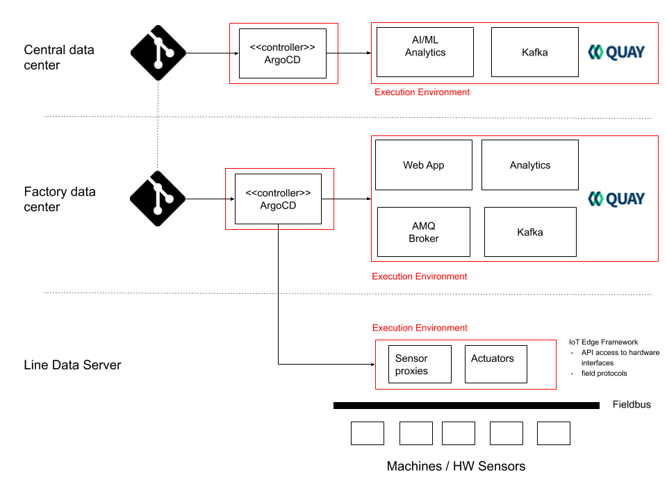

## Background

### Key concepts

#### GitOps Principles applied to factory edge

[https://blog.openshift.com/introduction-to-gitops-with-openshift/](https://blog.openshift.com/introduction-to-gitops-with-openshift/)

<table>
  <tr>
    <td>The definition of our systems is described as code</td>
    <td>The configuration for our systems can be treated as code, so we can store it and have it automatically versioned in Git, our single source of truth.
That way we can rollout and rollback changes in our systems in an easy way.
</td>
  </tr>
  <tr>
    <td>The desired system state and configuration is defined and versioned in Git</td>
    <td>Having the desired configuration of our systems stored and versioned in Git give us the ability to rollout / rollback changes easily to our systems and applications.
On top of that we can leverage Git’s security mechanisms in order to ensure the ownership and provenance of the code.</td>
  </tr>
  <tr>
    <td>Changes to the configuration can be automatically applied using PR mechanisms</td>
    <td>Using Git Pull Requests we can manage in an easy way how changes are applied to the stored configuration. You can request reviews from different team members, run CI tests, etc.
On top of that you don’t need to share your cluster credentials with anyone, the person committing the change only needs access to the Git repository where the configuration is stored.</td>
  </tr>
  <tr>
    <td>There is a controller that ensures no configuration drifts are present</td>
    <td>As the desired system state is present in Git, we only need a software that makes sure the current system state matches the desired system state. In case the states differ this software should be able to self-heal or notify the drift based on its configuration.
In this manufacturing edge use case we use ArgoCD as controller. The controller acts as deployment agent.</td>
  </tr>
</table>

The picture below illustrates the GitOps concepts in context of a factory edge use case. ArgoCD controllers ensure the desired state of the software and middleware components as well as the desired state of the configuration settings.

#### Example: Desired software state and configuration state of a machine sensor

1. Deployment Agent Configuration: The argo application manifest [argocd-ocp1.yaml](https://github.com/sa-mw-dach/manuela-gitops/blob/master/meta/argocd-ocp1.yaml) in the [meta directory](https://github.com/sa-mw-dach/manuela-gitops/tree/master/meta) describes an "deployment agent configuration". ArgoCD is a specific implementation of a deployment agent. The application manifest points to a git source and the target OpenShift cluster. The git source contains the desired state of a specific execution environment. In this example it is [deployment/execenv-ocp1](https://github.com/sa-mw-dach/manuela-gitops/tree/master/deployment/execenv-ocp1).

2. Execution Environments Deployment Data: The execution environment [execenv-ocp1](https://github.com/sa-mw-dach/manuela-gitops/tree/master/deployment/execenv-ocp1) has multiple manifests, an Argo application and a namespace. The [namespace yaml](https://github.com/sa-mw-dach/manuela-gitops/blob/master/deployment/execenv-ocp1/manuela-crc-machine-sensor-namespace.yaml) configures the target namespace for the machine sensor. The machine sensor deployment is managed via the Argo application [manuela-crc-machine-sensor-application.yaml](https://github.com/sa-mw-dach/manuela-gitops/blob/master/deployment/execenv-ocp1/manuela-crc-machine-sensor-application.yaml) which uses a dedicated Git repository and path ([config/instances/manuela-crc/machine-sensor](https://github.com/sa-mw-dach/manuela-gitops/tree/master/config/instances/manuela-crc/machine-sensor)) for the desired application instance of the machine sensor. By creating these manifests in the execution environment directory, the application is deployed. This means that the application instance configuration can be prepared, reviewed and approved before the actual deployment takes place.

3. Application Instance: In the current scenario, it is evident that many similar machine sensors in multiple execution environments need to be configured, deployed and managed. [Kustomize](https://kustomize.io/) simplifies the configuration of multiple machine sensors, because [Kustomize](https://kustomize.io/) is a template-free way to customize OpenShift application configuration.
The Kustomize manifest [kustomization.yaml](https://github.com/sa-mw-dach/manuela-gitops/blob/master/config/instances/manuela-crc/machine-sensor/kustomization.yaml) points to a [base directory](https://github.com/sa-mw-dach/manuela-gitops/tree/master/config/templates/manuela/machine-sensor) for the machine sensor deployment configuration. The config map [service-client-messaging-configmap.yaml](https://github.com/sa-mw-dach/manuela-gitops/blob/master/config/instances/manuela-crc/machine-sensor/service-client-messaging-configmap.yaml) in the instance directory specifies settings for the specific sensor for this application instance. In specific scenarios, the same application instance can be deployed to multiple execution environments - e.g. a globally load balanced application which creates the same endpoints / serves the same URLs in multiple clusters.

4. Application Template: The [template directory](https://github.com/sa-mw-dach/manuela-gitops/tree/master/config/templates/manuela/machine-sensor) contains all required manifests for the machine sensor:  The [configmap](https://github.com/sa-mw-dach/manuela-gitops/blob/master/config/templates/manuela/machine-sensor/service-client-messaging-configmap.yaml) with settings for the MQTT endpoint, the [deployment config for the pod](https://github.com/sa-mw-dach/manuela-gitops/blob/master/config/templates/manuela/machine-sensor/machine-sensor-dc.yaml) and the [image stream](https://github.com/sa-mw-dach/manuela-gitops/blob/master/config/templates/manuela/machine-sensor/machine-sensor-is.yaml). Thanks to the Kustomize functionality, there can be multiple levels of application templates: A production configuration can be based on a development configuration, etc...

