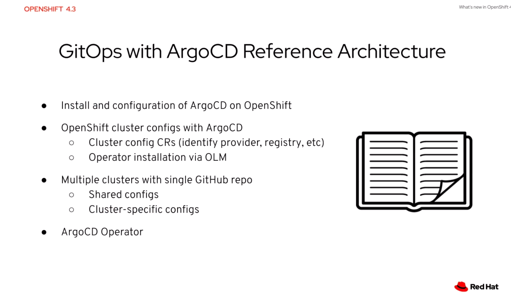
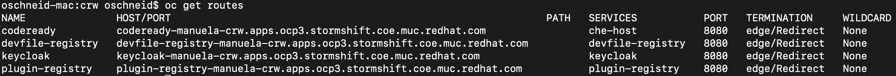
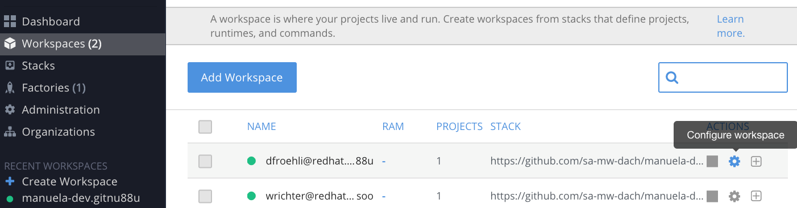

# MANUela


# Preface
This project is build and maintained by a group of solution architects at Red Hat. It originated from SAs responsible for diverse manufacturing customers in Germany and has grown to include other verticals as well. 

There are also further MANUela-linked projects for GitOps, ArgoCD and some demo apps to be deployed within the demo. 
You can check them out in this Github directory https://github.com/sa-mw-dach .

CAVEAT: Some of the technologies involved are bleeding edge, and so implementation details might change if a better tool is found for a particular purpose.  

**Please track any demo in the following sheet so we can understand how it is used:**

[https://docs.google.com/spreadsheets/d/17846bqUPEbXUmJ2i6KUYJ_k0yiJWmVW4flhKb83WDA4/edit#gid=0](https://docs.google.com/spreadsheets/d/17846bqUPEbXUmJ2i6KUYJ_k0yiJWmVW4flhKb83WDA4/edit#gid=0)


## Purpose
Show an exemplary horizontal solution blueprint for IoT Edge use cases applicable to different verticals.
## Intended audience
Everyone who needs to showcase IoT Edge use cases for the various verticals. New modules or enhancements to existing ones are always welcome.
## Possible use cases
IoT Edge with 5G, Machine Learning, OpenShift Multi-Cluster, Application Integration
# Conventions
## Naming
## Chapter structure
# Glossary
# Prerequisites and basic setup
First target environments are Stormshift and CRC
## OpenShift 
OCP 4.2+ is installed and running
## Argo CD
### Installing ArgoCD on OpenShift

Source: [https://blog.openshift.com/introduction-to-gitops-with-openshift/](https://blog.openshift.com/introduction-to-gitops-with-openshift/)

In order to deploy ArgoCD on OpenShift 4.x you can go ahead and follow the following steps as a cluster admin:

#### Deploy ArgoCD components on OpenShift

##### Deploy ArgoCD
Create a new namespace for ArgoCD components
```
oc new-project argocd
```
Grant access to manuela-team:
```
oc policy add-role-to-group admin manuela-team
```
Apply the ArgoCD Install Manifest
```bash
oc -n argocd apply -f [https://raw.githubusercontent.com/argoproj/argo-cd/v1.2.2/manifests/install.yaml](https://raw.githubusercontent.com/argoproj/argo-cd/v1.2.2/manifests/install.yaml)
oc apply -n argocd -f https://raw.githubusercontent.com/argoproj/argo-cd/v1.4.2/manifests/install.yaml**
```
Get the ArgoCD Server password
```bash
ARGOCD_SERVER_PASSWORD=$(oc -n argocd get pod -l "app.kubernetes.io/name=argocd-server" -o jsonpath='{.items[*].metadata.name}')**
echo $ARGOCD_SERVER_PASSWORD**
```
#### Patch ArgoCD Server Deployment so we can expose it using an OpenShift Route

Patch ArgoCD Server so no TLS is configured on the server (--insecure)
```bash
PATCH='{"spec":{"template":{"spec":{"$setElementOrder/containers":[{"name":"argocd-server"}],"containers":[{"command":["argocd-server","--insecure","--staticassets","/shared/app"],"name":"argocd-server"}]}}}}'
oc -n argocd patch deployment argocd-server -p $PATCH
```
Expose the ArgoCD Server using an Edge OpenShift Route so TLS is used for incoming connections
```
oc -n argocd create route edge argocd-server --service=argocd-server --port=http --insecure-policy=Redirect
```
#### Deploy ArgoCD Cli Tool (optional)

Download the argocd binary, place it under /usr/local/bin and give it execution permissions
```bash
#sudo curl -L https://github.com/argoproj/argo-cd/releases/download/v1.2.2/argocd-linux-amd64 -o /usr/local/bin/argocd
sudo curl -L https://github.com/argoproj/argo-cd/releases/download/v1.4.1/argocd-linux-amd64 -o /usr/local/bin/argocd
sudo chmod +x /usr/local/bin/argocd
```
#### Update ArgoCD Server Admin Password 

Get ArgoCD Server Route Hostname using argocd CLI
```bash
ARGOCD_ROUTE=$(oc -n argocd get route argocd-server -o jsonpath='{.spec.host}')
```
Login with the current admin password
```bash
argocd --insecure --grpc-web login ${ARGOCD_ROUTE}:443 --username admin --password ${ARGOCD_SERVER_PASSWORD}
```
Update admin's password
```bash
argocd --insecure --grpc-web --server ${ARGOCD_ROUTE}:443 account update-password --current-password ${ARGOCD_SERVER_PASSWORD} --new-password admin
```
using OC CLI
```bash
oc -n argocd patch secret argocd-secret  -p '{"stringData": { "admin.password": "'$(htpasswd -nbBC 10 admin admin | awk '{print substr($0,7)}')'", "admin.passwordMtime": "'$(date +%FT%T%Z)'" }}'**
```
Now you should be able to use the ArgoCD WebUI and the ArgoCD Cli tool to interact with the ArgoCD Server

#### Check pods and routes
```bash
oc get pods

NAME                                             READY   STATUS    RESTARTS   AGE
argocd-application-controller-7b96cb74dd-lst94   1/1     Running   0          12m
argocd-dex-server-58f5b5b44f-cfsw5               1/1     Running   0          12m
argocd-redis-868b8cb57f-dc6fl                    1/1     Running   0          12m
argocd-repo-server-5bf79d67f4-hvnwx              1/1     Running   0          12m
argocd-server-888f8b6b8-scvll                    1/1     Running   0          7m16s

oc get routes

NAME            HOST/PORT                               PATH   SERVICES        PORT   TERMINATION     WILDCARD
argocd-server   argocd-server-argocd.apps-crc.testing          argocd-server   http   edge/Redirect   None
```
#### Login into Argo web UI

E.g. [https://argocd-server-argocd.apps-crc.testing/applications](https://argocd-server-argocd.apps-crc.testing/applications) 

User: admin, Password: admin

OCP3 Cluster: [https://argocd-server-argocd.apps.ocp3.stormshift.coe.muc.redhat.com/](https://argocd-server-argocd.apps.ocp3.stormshift.coe.muc.redhat.com/)

#### To-do: Check/test ArgoCD Operator

[https://github.com/argoproj-labs/argocd-operator/blob/master/docs/usage.md](https://github.com/argoproj-labs/argocd-operator/blob/master/docs/usage.md)



#### To-do: Test Installation of Argo CD which requires only namespace level privileges

[https://github.com/argoproj/argo-cd/tree/master/manifests](https://github.com/argoproj/argo-cd/tree/master/manifests)

#### Prepare Container Images by building and Deploying Manuela-Dev

Check out manuela-dev repository
```bash
cd ~
git clone ****[https://github.com/sa-mw-dach/manuela-dev.gi**t](https://github.com/sa-mw-dach/manuela-dev.git)
```
#### Build MANUela Containers in iotdemo namespace

Build manuela app on clusters so that imagestreams and images in local registry exist
```bash
cd ~/manuela-dev/components
```
Adjust the ConfigMaps to the target environment
```bash
diff --git a/components/iot-frontend/manifests/iot-frontend-configmap.yaml b/components/iot-frontend/manifests/iot-frontend-configmap.yaml

index dac9161..363152e 100644
--- a/components/iot-frontend/manifests/iot-frontend-configmap.yaml
+++ b/components/iot-frontend/manifests/iot-frontend-configmap.yaml

@@ -5,7 +5,7 @@ metadata:
 data:
   config.json: |-
     {
-        "websocketHost": "http://iot-consumer-iotdemo.apps.ocp4.stormshift.coe.muc.redhat.com",
+        "websocketHost": "http://iot-consumer-iotdemo.apps.ocp3.stormshift.coe.muc.redhat.com",
         "websocketPath": "/api/service-web/socket",
         "SERVER_TIMEOUT": 20000
     }
\ No newline at end of file
```
#### Adjust the Quay Secret

Login to [https://quay.io/organization/manuela?tab=robots](https://quay.io/organization/manuela?tab=robots)

Copy to .dockerconfigjson from the robo account "manuela-build" to the clipboard

Paste it to the manuela-dev/components/iot-demo-secrets.yaml into the <<replace_me_with_value_from_quay.io_robo_account>>

#### Trigger Build & Deploy on Dev Cluster

run the following commands twice since the first invocation will partially fail due to the AMQbroker CRD taking a while to be available
```bash
oc apply -k .
oc apply -k .
```
#### Configure ArgoCD deployment agent

The following clones the manuela-gitops repo into your home directory. Should you choose to put it somewhere else, you need to adapt all following commands accordingly.
```bash
cd ~
git clone ****[git@github.co**m](mailto:git@github.com)**:sa-mw-dach/manuela-gitops.git
cd ~/manuela-gitops/meta/
```
Choose your target execution environment, this example uses ocp3
```bash
oc apply -n argocd -f argocd-<yourtargetenv>.yaml

application.argoproj.io/ocp3 created
```
To remove:
```bash
oc delete -n argocd -f argocd-<yourtargetenv>.yaml

application.argoproj.io "ocp3" deleted
```
## Set up CI/CD Pipeline

### Deploy OpenShift Pipelines aka Tekton via Operator

OCP V4.2+: 

Either follow instructions to deploy Tekton via operator here: [https://github.com/openshift/pipelines-tutorial/blob/master/install-operator.md](https://github.com/openshift/pipelines-tutorial/blob/master/install-operator.md) or create it declaratively:
```bash
cd ~/manuela-dev/infrastructure/openshift-pipelines
oc apply -k .
```


### Instantiate MANUela CI project
```bash
cd ~/manuela-dev/tekton
oc apply -k .
```
This creates the manuela-ci project, pipelines, etc...

### Prepare & create secrets

Background: We can’t store git secrets in git, and have not yet handled vault/secret management. Thus, you need to manually add your personal git or quay robo account secret)
```bash
cd ~/manuela-dev/tekton/secrets
cp github-example.yaml github.yaml
```
You have to adjust secret with personal access token of a github user that can push to the repo:
```bash
vi github.yaml
cp quay-build-secret-example.yaml quay-build-secret.yaml
```
Adjust secret with dockerconfig of a quay robo account with push permissions

Login to [https://quay.io/organization/manuela?tab=robots](https://quay.io/organization/manuela?tab=robots)

Copy to .dockerconfigjson from the robo account "manuela-build" to the clipboard

Paste it to the .dockerconfigjson attribute in the yaml:
```bash
vi quay-build-secret.yaml
oc apply -k .
```
## CodeReady Workspaces as Cloud IDE for manuela-dev

### Setting up CRW

The Kubernetes artifacts to set up CRW are located in the manuela-dev git repository.
```bash
cd ~/manuela-dev/infrastructure/crw
oc apply -k .
```
This will create the following: 

1. Create a new project manuela-crw in the current logged in OCP

2. Create an OperatorGroup CR to make the OLM aware of an operator in this namespace

3. Create an CRW Operator Subscription from the latest stable channel -> installs the CRW operator in the namespace manuela-crw

4. Create an actual CheCluster in the namespace manuela-crw with following custom properties:

    1. customCheProperties:

    2.      CHE_LIMITS_USER_WORKSPACES_RUN_COUNT: '10'

    3.      CHE_LIMITS_WORKSPACE_IDLE_TIMEOUT: '-1'

CRW should be available after about 3-5 minutes.

### Login to CRW

Look for the Route with the name **codeready:**
```bash
oc project manuela-crw
oc get routes
```


To verify deployment, you can login to CRW: [https://codeready-manuela-crw.apps.ocp3.stormshift.coe.muc.redhat.com/](https://codeready-manuela-crw.apps.ocp3.stormshift.coe.muc.redhat.com/)

Use your OpenShift Account (OpenShift OAuth is enabled). But you could also skip this step and test it by directly creating your workspace.

### Create your MANUela Cloud IDE workspace

To start developing with manuela-dev, please go to the manuela-dev git repository ([https://github.com/sa-mw-dach/manuela-dev.git](https://github.com/sa-mw-dach/manuela-dev.git)) and follow the instructions of the Readme document. 

Please click on this link [https://codeready-manuela-crw.apps.ocp3.stormshift.coe.muc.redhat.com/factory?url=https://github.com/sa-mw-dach/manuela-dev.git](https://codeready-manuela-crw.apps.ocp3.stormshift.coe.muc.redhat.com/factory?url=https://github.com/sa-mw-dach/manuela-dev.git) to create/clone your manuela-dev workspace in the CRW instance in the Stormshift OCP3 cluster.

By clicking the link above, CRW will start searching for a devfile.yaml in the root of the git repository…

The devfile.yaml is the specification of a CodeReady workspace.

After 2-3 minutes you should be able to start coding. 

If not:

*  try to reload the page in the browser, or re-create the workspace from the CRW Dashboard.

* If the commands and plugins are missing.

    * From the CRW Workspaces, Choose the Configure Action:

    * 

    * Stop the workspace: 

    * In the Devfile Section,  add the "components:" section from this file: [https://github.com/sa-mw-dach/manuela-dev/blob/master/devfile.yaml](https://github.com/sa-mw-dach/manuela-dev/blob/master/devfile.yaml)

### Local MANUela development with CRW

The devfile sets up a CRW workspace with currently 3 runtime components:
* AMQ 7.5 message broker
* Java (SpringBoot) container for iot-software-sensor
* NodeJS container for iot-consumer

TODO: 

## Prepare Firewall Operator Demo

### Set Up pfSense Firewall VM

Download pfSense ISO (CD/DVD) image from: [https://www.pfsense.org/download/](https://www.pfsense.org/download/)

Upload the ISO image to [https://rhev.stormshift.coe.muc.redhat.com/](https://rhev.stormshift.coe.muc.redhat.com/)


Created 2 new VMs (mpfuetzn-ocp3-pfsense and mpfuetzn-ocp4-pfsense) as follows:


Added Network Interfaces as follows:


(replace ocp3 for ocp4 in the second machine!)

Attach the CD-ISO image to the VM to boot from for the first time

After install, and after the first reboot (do not forget to remove the CD-ISO Image!) configure as follows:
* NO VLANS
* WAN interface is vtnet1 (aka the ocp3-network)
* LAN interface is vtnet0 (aka the ovirtmgt network)
* LAN now also needs a fix IP and a router: ocp3 has 10.32.111.165/20 as IP and 10.32.111.254 as router, ocp4 has 10.32.111.166/20 as ip and the same router
* WAN gets its IP via DHCP in the range of 172.16.10.???/24

That’s it…

Default password for the appliances is admin/pfsense

For the demo ssh-access needs to additionally be enabled and keys generated, can be done via GUI, or check the github repository. Because the operator needs to be able to access the pfsense appliance via ansible, and that’s done via ssh…:

#### Generate keypair
```
$ ssh-keygen -f keypair

Generating public/private rsa key pair.
Enter passphrase (empty for no passphrase):
Enter same passphrase again:
Your identification has been saved in keypair.
Your public key has been saved in keypair.pub.
The key fingerprint is:
SHA256:e2hUI5thMlfnCCpLW3gS1ClipfGywPYY391+SrO8xx4 vagrant@ibm-p8-kvm-03-guest-02.virt.pnr.lab.eng.rdu2.redhat.com
The key's randomart image is:
+---[RSA 2048]----+
|  .o+. .. . .    |
|. o+.oo. o +     |
|.=o.*.* = + .    |
|..=+.B.=.* .     |
| ..oo. .S.       |
|       ..o       |
|        ++oE     |
|       .o.=o.    |
|         =+.     |
+----[SHA256]-----+

$ cat keypair.pub
ssh-rsa AAAAB3NzaC1yc2EAAAADAQABAAABAQCw5CP4Sj1qp6cLb2Bp6grN59qOUuBrOfz7mc12848TP+PyLtS8KL6GBpb0ySOzEMIJdxhiZNHLiSLzh7mtHH0YXTdErdjD2hK9SOt9OmJrys8po9BLhVvacdRDS0l2BFyxG7gaCU92ZmTJHKtLi2jpOLMFNXl5oSva0u5WL+iYQJhgBCezxCSKhUquxLL9Ua9NThkhb064xzm7Vw0Qx53VY89O6dOX7MFeLM19YT1jfLDJ0CGWNju3dyFbQNNmn/ZquP91DFeV9mTS2lP/H+bd20osDScEzE+c3zeDsP8UmLbOhBsQs6kRXLos58Ag3vjCommULfPnHvTFbgVKbwnh [vagrant@ibm-p8-kvm-03-guest-02.virt.pnr.lab.eng.rdu2.redhat.com](mailto:vagrant@ibm-p8-kvm-03-guest-02.virt.pnr.lab.eng.rdu2.redhat.com)
```
Log into pfsense firewall with default username/pw
```
$ ssh root@10.32.111.165

The authenticity of host '10.32.111.165 (10.32.111.165)' can't be established.
ED25519 key fingerprint is SHA256:ZoXQTnMit+NaHMvQbfTPT3/ztn+xkUB7BrVSptxjBvg.
Are you sure you want to continue connecting (yes/no)? yes
Warning: Permanently added '10.32.111.165' (ED25519) to the list of known hosts.
Password for root@pfSense.localdomain:

pfSense - Netgate Device ID: 445f648407f99eee6675

*** Welcome to pfSense 2.4.4-RELEASE-p3 (amd64) on pfSense ***
 WAN (wan)       -> vtnet1     -> v4/DHCP4: 172.16.10.102/24
 LAN (lan)       -> vtnet0     -> v4: 10.32.111.165/20
 0) Logout (SSH only)                  9) pfTop
 1) Assign Interfaces                 10) Filter Logs
 2) Set interface(s) IP address       11) Restart webConfigurator
 3) Reset webConfigurator password    12) PHP shell + pfSense tools
 4) Reset to factory defaults         13) Update from console
 5) Reboot system                     14) Disable Secure Shell (sshd)
 6) Halt system                       15) Restore recent configuration
 7) Ping host                         16) Restart PHP-FPM
 8) Shell
Enter an option: **8**

[2.4.4-RELEASE][root@pfSense.localdomain]/root: cat >>.ssh/authorized_keys

ssh-rsa AAAAB3NzaC1yc2EAAAADAQABAAABAQCw5CP4Sj1qp6cLb2Bp6grN59qOUuBrOfz7mc12848TP+PyLtS8KL6GBpb0ySOzEMIJdxhiZNHLiSLzh7mtHH0YXTdErdjD2hK9SOt9OmJrys8po9BLhVvacdRDS0l2BFyxG7gaCU92ZmTJHKtLi2jpOLMFNXl5oSva0u5WL+iYQJhgBCezxCSKhUquxLL9Ua9NThkhb064xzm7Vw0Qx53VY89O6dOX7MFeLM19YT1jfLDJ0CGWNju3dyFbQNNmn/ZquP91DFeV9mTS2lP/H+bd20osDScEzE+c3zeDsP8UmLbOhBsQs6kRXLos58Ag3vjCommULfPnHvTFbgVKbwnh vagrant@ibm-p8-kvm-03-guest-02.virt.pnr.lab.eng.rdu2.redhat.com**

[2.4.4-RELEASE][root@pfSense.localdomain]/root: exit

exit

pfSense - Netgate Device ID: 445f648407f99eee6675

*** Welcome to pfSense 2.4.4-RELEASE-p3 (amd64) on pfSense ***
 WAN (wan)       -> vtnet1     -> v4/DHCP4: 172.16.10.102/24
 LAN (lan)       -> vtnet0     -> v4: 10.32.111.165/20
 0) Logout (SSH only)                  9) pfTop
 1) Assign Interfaces                 10) Filter Logs
 2) Set interface(s) IP address       11) Restart webConfigurator
 3) Reset webConfigurator password    12) PHP shell + pfSense tools
 4) Reset to factory defaults         13) Update from console
 5) Reboot system                     14) Disable Secure Shell (sshd)
 6) Halt system                       15) Restore recent configuration
 7) Ping host                         16) Restart PHP-FPM
 8) Shell
Enter an option: **^D**
Connection to 10.32.111.165 closed.
```
### Install & Prepare the firewall operator

Prerequisite: manuela-dev repo cloned in step [Prepare Container Images by building and Deploying Manuela-Dev](#heading=h.twyt1w9p4m9m) 

Choose a cluster which will act as management cluster for the firewall and log into it via OC

#### Prepare a secret for the operator deployment 
```bash
cd ~/manuela-dev/networkpathoperator/firewallrule/
cp deploy/firewall-inventory-secret-example.yaml deploy/firewall-inventory-secret.yaml
vi deploy/firewall-inventory-secret.yaml
```
Adjust hostname, username, SSH private key for firewall access as created before

#### Deploy operator to new namespace
```bash
oc new-project manuela-networkpathoperator
oc apply -f deploy/firewall-inventory-secret.yaml
oc apply -k deploy
```
Validate that the firewall rule in deploy/crds/manuela.redhat.com_v1alpha1_firewallrule_cr.yaml is created appropriately in the firewall **(via firewall UI)**.

#### Remove the firewall rule 
```bash
oc delete -f deploy/crds/manuela.redhat.com_v1alpha1_firewallrule_cr.yaml
```
Validate that the firewall rule in deploy/crds/manuela.redhat.com_v1alpha1_firewallrule_cr.yaml is removed appropriately from the firewall **(via firewall UI)**.

#### Deploy argocd configuration for the network path
```bash
cd ~/manuela-gitops/meta/
oc apply -n argocd -f argocd-nwpath-ocp3-ocp4.yaml
```
# Architecture
## Demo structure
### Components
### Architecture decisions
### Git Repo structure
schon mal hier versucht zu verfassen: https://github.com/sa-mw-dach/manuela/tree/master/docs/architecture , ...)
# Demo setup / cleanup
# Horizontal Modules
## CodeReady Workspaces
## Tekton and ArgoCD
# Vertical Modules
## Manufacturing
## Retail 
## Asset Management for Energies
## Edge on the train
## Managing multiple data centers
