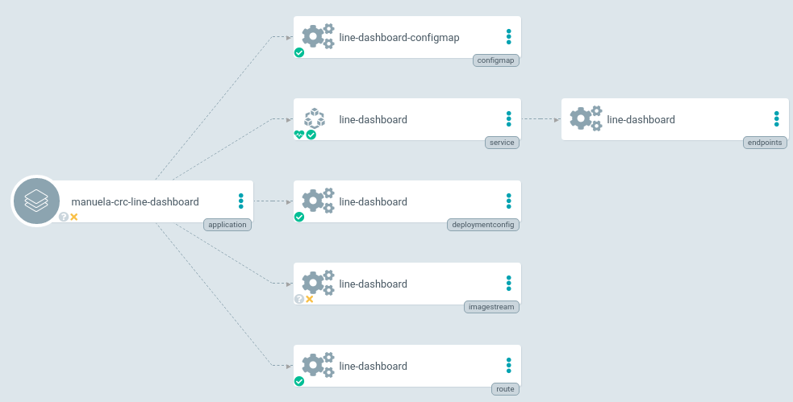
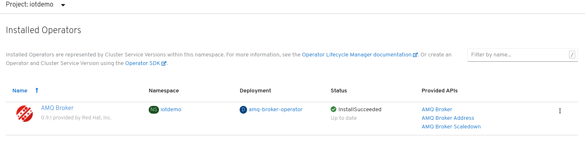
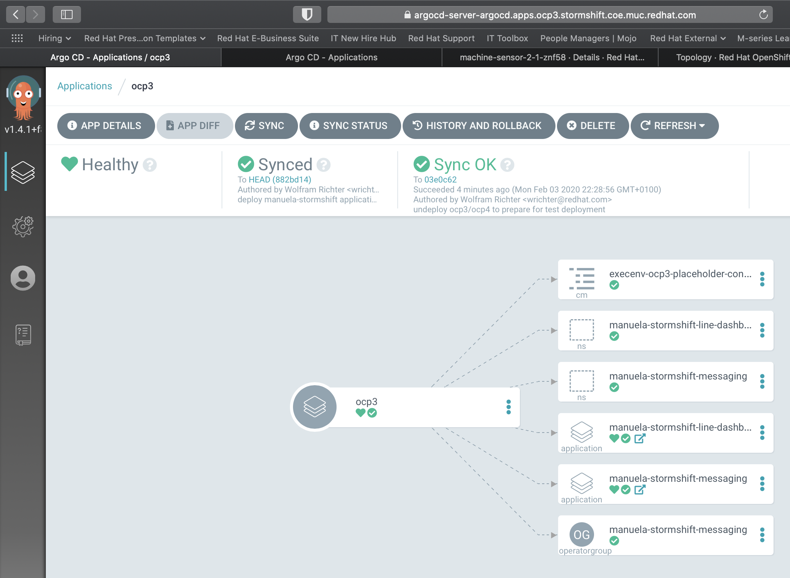
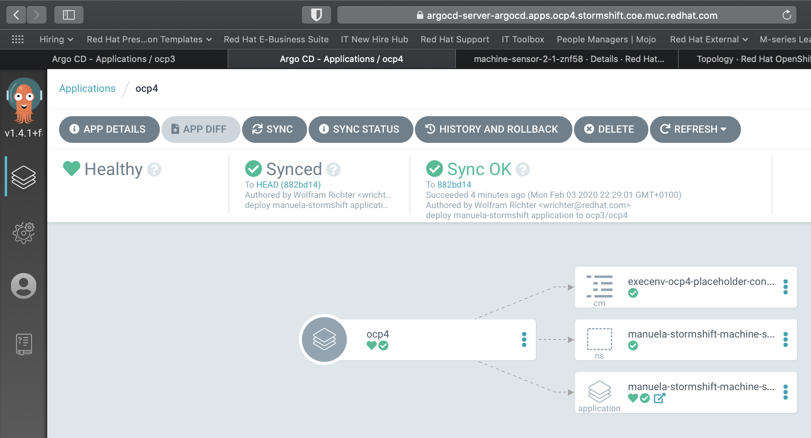

## Argo CD
### Installing ArgoCD on OpenShift

Source: [https://blog.openshift.com/introduction-to-gitops-with-openshift/](https://blog.openshift.com/introduction-to-gitops-with-openshift/)

In order to deploy ArgoCD on OpenShift 4.x you can go ahead and follow the following steps as a cluster admin:

#### Deploy ArgoCD components on OpenShift via Operator
```bash
cd ~/manuela-dev/infrastructure
oc apply -k argocd
oc apply -k argocd
oc adm policy add-cluster-role-to-user cluster-admin -n argocd -z argocd-application-controller
```

#### Check pods and routes
```bash
oc get pods

NAME                                             READY   STATUS    RESTARTS   AGE
argocd-application-controller-7b96cb74dd-lst94   1/1     Running   0          12m
argocd-dex-server-58f5b5b44f-cfsw5               1/1     Running   0          12m
argocd-redis-868b8cb57f-dc6fl                    1/1     Running   0          12m
argocd-repo-server-5bf79d67f4-hvnwx              1/1     Running   0          12m
argocd-server-888f8b6b8-scvll                    1/1     Running   0          7m16s

oc get routes

NAME            HOST/PORT                               PATH   SERVICES        PORT   TERMINATION     WILDCARD
argocd-server   argocd-server-argocd.apps-crc.testing          argocd-server   http   edge/Redirect   None
```

<!--##### Deploy ArgoCD
Create a new namespace for ArgoCD components
```
oc new-project argocd
```
Grant access to manuela-team:
```
oc policy add-role-to-group admin manuela-team
```
Apply the ArgoCD Install Manifest
```bash
oc apply -n argocd -f https://raw.githubusercontent.com/argoproj/argo-cd/v1.4.2/manifests/install.yaml**
```
Get the ArgoCD Server password
```bash
ARGOCD_SERVER_PASSWORD=$(oc -n argocd get pod -l "app.kubernetes.io/name=argocd-server" -o jsonpath='{.items[*].metadata.name}')**
echo $ARGOCD_SERVER_PASSWORD**
```
#### Patch ArgoCD Server Deployment so we can expose it using an OpenShift Route

Patch ArgoCD Server so no TLS is configured on the server (--insecure)
```bash
PATCH='{"spec":{"template":{"spec":{"$setElementOrder/containers":[{"name":"argocd-server"}],"containers":[{"command":["argocd-server","--insecure","--staticassets","/shared/app"],"name":"argocd-server"}]}}}}'
oc -n argocd patch deployment argocd-server -p $PATCH
```
Expose the ArgoCD Server using an Edge OpenShift Route so TLS is used for incoming connections
```
oc -n argocd create route edge argocd-server --service=argocd-server --port=http --insecure-policy=Redirect
```
-->


#### Deploy ArgoCD Cli Tool (optional)

Download the argocd binary, place it under /usr/local/bin and give it execution permissions
```bash
sudo curl -L https://github.com/argoproj/argo-cd/releases/download/v1.4.1/argocd-linux-amd64 -o /usr/local/bin/argocd
sudo chmod +x /usr/local/bin/argocd
```

#### Update ArgoCD Server Admin Password
<!--##### via ArgoCD CLI
Get ArgoCD Server Route Hostname using argocd CLI
```bash
ARGOCD_ROUTE=$(oc -n argocd get route argocd-server -o jsonpath='{.spec.host}')
```
Login with the current admin password
```bash
argocd --insecure --grpc-web login ${ARGOCD_ROUTE}:443 --username admin --password ${ARGOCD_SERVER_PASSWORD}
```
Update admin's password
```bash
argocd --insecure --grpc-web --server ${ARGOCD_ROUTE}:443 account update-password --current-password ${ARGOCD_SERVER_PASSWORD} --new-password admin
```
##### using OC CLI -->
```bash
oc -n argocd patch secret argocd-secret  -p '{"stringData": { "admin.password": "'$(htpasswd -nbBC 10 admin admin | awk '{print substr($0,7)}')'", "admin.passwordMtime": "'$(date +%FT%T%Z)'" }}'
```
#### Login into Argo web UI

E.g. [https://argocd-server-argocd.apps-crc.testing/applications](https://argocd-server-argocd.apps-crc.testing/applications)

User: admin, Password: admin - or log in via openshift auth

OCP3 Cluster: [https://argocd-server-argocd.apps.ocp3.stormshift.coe.muc.redhat.com/](https://argocd-server-argocd.apps.ocp3.stormshift.coe.muc.redhat.com/)


#### To-do: Test Installation of Argo CD which requires only namespace level privileges

[https://github.com/argoproj/argo-cd/tree/master/manifests](https://github.com/argoproj/argo-cd/tree/master/manifests)


### Prepare Container Images by building and Deploying Manuela-Dev

#### Build MANUela Containers in iotdemo namespace

Build manuela app on clusters so that imagestreams and images in local registry exist
```bash
cd ~/manuela-dev/components
```
Adjust the ConfigMaps to the target environment
```bash
diff --git a/components/iot-frontend/manifests/iot-frontend-configmap.yaml b/components/iot-frontend/manifests/iot-frontend-configmap.yaml

index dac9161..363152e 100644
--- a/components/iot-frontend/manifests/iot-frontend-configmap.yaml
+++ b/components/iot-frontend/manifests/iot-frontend-configmap.yaml

@@ -5,7 +5,7 @@ metadata:
 data:
   config.json: |-
     {
-        "websocketHost": "http://iot-consumer-iotdemo.apps.ocp4.stormshift.coe.muc.redhat.com",
+        "websocketHost": "http://iot-consumer-iotdemo.apps.ocp3.stormshift.coe.muc.redhat.com",
         "websocketPath": "/api/service-web/socket",
         "SERVER_TIMEOUT": 20000
     }
\ No newline at end of file
```
#### Adjust the Quay Secret

Login to [https://quay.io/organization/manuela?tab=robots](https://quay.io/organization/manuela?tab=robots)

Copy to .dockerconfigjson from the robo account "manuela-build" to the clipboard

Paste it to the manuela-dev/components/iot-demo-secrets.yaml into the <<replace_me_with_value_from_quay.io_robo_account>>

#### Trigger Build & Deploy on Dev Cluster

run the following commands twice since the first invocation will partially fail due to the AMQbroker CRD taking a while to be available
```bash
oc apply -k .
oc apply -k .
```
#### Configure ArgoCD deployment agent

The following clones the manuela-gitops repo into your home directory. Should you choose to put it somewhere else, you need to adapt all following commands accordingly.
```bash
cd ~
git clone ****[git@github.co**m](mailto:git@github.com)**:sa-mw-dach/manuela-gitops.git
cd ~/manuela-gitops/meta/
```
Choose your target execution environment, this example uses ocp3
```bash
oc apply -n argocd -f argocd-<yourtargetenv>.yaml

application.argoproj.io/ocp3 created
```
To remove:
```bash
oc delete -n argocd -f argocd-<yourtargetenv>.yaml

application.argoproj.io "ocp3" deleted
```


## Set up CI/CD Pipeline

### Deploy OpenShift Pipelines aka Tekton via Operator

OCP V4.2+:

Either follow instructions to deploy Tekton via operator here: [https://github.com/openshift/pipelines-tutorial/blob/master/install-operator.md](https://github.com/openshift/pipelines-tutorial/blob/master/install-operator.md) or create it declaratively:
```bash
cd ~/manuela-dev/infrastructure/openshift-pipelines
oc apply -k .
```


### Instantiate MANUela CI project
```bash
cd ~/manuela-dev/tekton
oc apply -k .
```
This creates the manuela-ci project, pipelines, etc...

### Prepare & create secrets

Background: We can’t store git secrets in git, and have not yet handled vault/secret management. Thus, you need to manually add your personal git or quay robo account secret)
```bash
cd ~/manuela-dev/tekton/secrets
cp github-example.yaml github.yaml
```
You have to adjust secret with personal access token of a github user that can push to the repo:
```bash
vi github.yaml
cp quay-build-secret-example.yaml quay-build-secret.yaml
```
Adjust secret with dockerconfig of a quay robo account with push permissions

Login to [https://quay.io/organization/manuela?tab=robots](https://quay.io/organization/manuela?tab=robots)

Copy to .dockerconfigjson from the robo account "manuela-build" to the clipboard

Paste it to the .dockerconfigjson attribute in the yaml:
```bash
vi quay-build-secret.yaml
oc apply -k .
```

## Prepare Firewall Operator Demo

### Set Up pfSense Firewall VM

Download pfSense ISO (CD/DVD) image from: [https://www.pfsense.org/download/](https://www.pfsense.org/download/)

Upload the ISO image to [https://rhev.stormshift.coe.muc.redhat.com/](https://rhev.stormshift.coe.muc.redhat.com/)


Created 2 new VMs (mpfuetzn-ocp3-pfsense and mpfuetzn-ocp4-pfsense) as follows:


Added Network Interfaces as follows:


(replace ocp3 for ocp4 in the second machine!)

Attach the CD-ISO image to the VM to boot from for the first time

After install, and after the first reboot (do not forget to remove the CD-ISO Image!) configure as follows:
* NO VLANS
* WAN interface is vtnet1 (aka the ocp3-network)
* LAN interface is vtnet0 (aka the ovirtmgt network)
* LAN now also needs a fix IP and a router: ocp3 has 10.32.111.165/20 as IP and 10.32.111.254 as router, ocp4 has 10.32.111.166/20 as ip and the same router
* WAN gets its IP via DHCP in the range of 172.16.10.???/24

That’s it…

Default password for the appliances is admin/pfsense

For the demo ssh-access needs to additionally be enabled and keys generated, can be done via GUI, or check the github repository. Because the operator needs to be able to access the pfsense appliance via ansible, and that’s done via ssh…:

#### Generate keypair
```
$ ssh-keygen -f keypair

Generating public/private rsa key pair.
Enter passphrase (empty for no passphrase):
Enter same passphrase again:
Your identification has been saved in keypair.
Your public key has been saved in keypair.pub.
The key fingerprint is:
SHA256:e2hUI5thMlfnCCpLW3gS1ClipfGywPYY391+SrO8xx4 vagrant@ibm-p8-kvm-03-guest-02.virt.pnr.lab.eng.rdu2.redhat.com
The key's randomart image is:
+---[RSA 2048]----+
|  .o+. .. . .    |
|. o+.oo. o +     |
|.=o.*.* = + .    |
|..=+.B.=.* .     |
| ..oo. .S.       |
|       ..o       |
|        ++oE     |
|       .o.=o.    |
|         =+.     |
+----[SHA256]-----+

$ cat keypair.pub
ssh-rsa AAAAB3NzaC1yc2EAAAADAQABAAABAQCw5CP4Sj1qp6cLb2Bp6grN59qOUuBrOfz7mc12848TP+PyLtS8KL6GBpb0ySOzEMIJdxhiZNHLiSLzh7mtHH0YXTdErdjD2hK9SOt9OmJrys8po9BLhVvacdRDS0l2BFyxG7gaCU92ZmTJHKtLi2jpOLMFNXl5oSva0u5WL+iYQJhgBCezxCSKhUquxLL9Ua9NThkhb064xzm7Vw0Qx53VY89O6dOX7MFeLM19YT1jfLDJ0CGWNju3dyFbQNNmn/ZquP91DFeV9mTS2lP/H+bd20osDScEzE+c3zeDsP8UmLbOhBsQs6kRXLos58Ag3vjCommULfPnHvTFbgVKbwnh [vagrant@ibm-p8-kvm-03-guest-02.virt.pnr.lab.eng.rdu2.redhat.com](mailto:vagrant@ibm-p8-kvm-03-guest-02.virt.pnr.lab.eng.rdu2.redhat.com)
```
Log into pfsense firewall with default username/pw
```
$ ssh root@10.32.111.165

The authenticity of host '10.32.111.165 (10.32.111.165)' can't be established.
ED25519 key fingerprint is SHA256:ZoXQTnMit+NaHMvQbfTPT3/ztn+xkUB7BrVSptxjBvg.
Are you sure you want to continue connecting (yes/no)? yes
Warning: Permanently added '10.32.111.165' (ED25519) to the list of known hosts.
Password for root@pfSense.localdomain:

pfSense - Netgate Device ID: 445f648407f99eee6675

*** Welcome to pfSense 2.4.4-RELEASE-p3 (amd64) on pfSense ***
 WAN (wan)       -> vtnet1     -> v4/DHCP4: 172.16.10.102/24
 LAN (lan)       -> vtnet0     -> v4: 10.32.111.165/20
 1) Logout (SSH only)                  9) pfTop
 2) Assign Interfaces                 10) Filter Logs
 3) Set interface(s) IP address       11) Restart webConfigurator
 4) Reset webConfigurator password    12) PHP shell + pfSense tools
 5) Reset to factory defaults         13) Update from console
 6) Reboot system                     14) Disable Secure Shell (sshd)
 7) Halt system                       15) Restore recent configuration
 8) Ping host                         16) Restart PHP-FPM
 9) Shell
Enter an option: **8**

[2.4.4-RELEASE][root@pfSense.localdomain]/root: cat >>.ssh/authorized_keys

ssh-rsa AAAAB3NzaC1yc2EAAAADAQABAAABAQCw5CP4Sj1qp6cLb2Bp6grN59qOUuBrOfz7mc12848TP+PyLtS8KL6GBpb0ySOzEMIJdxhiZNHLiSLzh7mtHH0YXTdErdjD2hK9SOt9OmJrys8po9BLhVvacdRDS0l2BFyxG7gaCU92ZmTJHKtLi2jpOLMFNXl5oSva0u5WL+iYQJhgBCezxCSKhUquxLL9Ua9NThkhb064xzm7Vw0Qx53VY89O6dOX7MFeLM19YT1jfLDJ0CGWNju3dyFbQNNmn/ZquP91DFeV9mTS2lP/H+bd20osDScEzE+c3zeDsP8UmLbOhBsQs6kRXLos58Ag3vjCommULfPnHvTFbgVKbwnh vagrant@ibm-p8-kvm-03-guest-02.virt.pnr.lab.eng.rdu2.redhat.com**

[2.4.4-RELEASE][root@pfSense.localdomain]/root: exit

exit

pfSense - Netgate Device ID: 445f648407f99eee6675

*** Welcome to pfSense 2.4.4-RELEASE-p3 (amd64) on pfSense ***
 WAN (wan)       -> vtnet1     -> v4/DHCP4: 172.16.10.102/24
 LAN (lan)       -> vtnet0     -> v4: 10.32.111.165/20
 0) Logout (SSH only)                  9) pfTop
 1) Assign Interfaces                 10) Filter Logs
 2) Set interface(s) IP address       11) Restart webConfigurator
 3) Reset webConfigurator password    12) PHP shell + pfSense tools
 4) Reset to factory defaults         13) Update from console
 5) Reboot system                     14) Disable Secure Shell (sshd)
 6) Halt system                       15) Restore recent configuration
 7) Ping host                         16) Restart PHP-FPM
 8) Shell
Enter an option: **^D**
Connection to 10.32.111.165 closed.
```
### Install & Prepare the firewall operator

Prerequisite: manuela-dev repo cloned in step [Prepare Container Images by building and Deploying Manuela-Dev](#heading=h.twyt1w9p4m9m)

Choose a cluster which will act as management cluster for the firewall and log into it via OC

#### Prepare a secret for the operator deployment
```bash
cd ~/manuela-dev/networkpathoperator/firewallrule/
cp deploy/firewall-inventory-secret-example.yaml deploy/firewall-inventory-secret.yaml
vi deploy/firewall-inventory-secret.yaml
```
Adjust hostname, username, SSH private key for firewall access as created before

#### Deploy operator to new namespace
```bash
oc new-project manuela-networkpathoperator
oc apply -f deploy/firewall-inventory-secret.yaml
oc apply -k deploy
```
Validate that the firewall rule in deploy/crds/manuela.redhat.com_v1alpha1_firewallrule_cr.yaml is created appropriately in the firewall **(via firewall UI)**.


#### What does the demo deploy?

##### Machine-sensor to OCP1: argocd-ocp1.yaml:


* ocp1 (Argo CRD:  application) is a "deployment agent configuration" >  Source: deployment/execenv-ocp1

* Configmap: execenv-ocp1-placeholder-configmap. (*)
*Placeholder only so that there is always some content for ArgoCD that can be synced even though nothing is deployed.

* Namespace: manuela-crc-machine-sensor: Namespace for the machine sensor

* Application: manuela-crc-machine-sensor (Argo CRD) -> Source: config/instances/manuela-crc/machine-sensor

    * Configmap: service-client-messaging: Settings for MQTT Endpoint

    * Deploymentconfig: machine-sensor:

    * Imagestream: machine-sensor

#### Line Dashboard and messaging  to OCP2: argocd-ocp2.yaml:




#### OCP3: argocd-ocp3.yaml: (Use case?)


Note, the configmap placeholder is a workaround because Argo cannot handle updates on "empty" applications.

## IoT Runtime Demo

[https://github.com/sa-mw-dach/manuela-dev](https://github.com/sa-mw-dach/manuela-dev)

### Prerequisites

* Active MQArtemises Instance (?)

### Installation
```bash
git clone [git@github.com](mailto:git@github.com):sa-mw-dach/manuela-dev.git
cd manuela-dev/components/
oc apply -k .
oc apply -k .
```
#### Installed AMQ Operator



#### Install Pods


#### Routes

#### Dashboard


# Horizontal Modules
## CodeReady Workspaces
## Tekton and ArgoCD
# Vertical Modules
## Manufacturing
## Retail
## Asset Management for Energies
## Edge on the train
## Managing multiple data centers


#### Application Templating Concept
```bash
cd manuela-gitops/config/templates
```
multiple application templates exist (which can even reference one another)
```bash
ls

manuela		manuela-openshift	manuela-openshift-prod
```
Each application component has is configured in its own directory
```bash
ls manuela/

line-dashboard	machine-sensor	messaging
```
A component is configured via kustomize & k8s manifests (maybe explain kustomize here already)
```bash
ls manuela/machine-sensor/

kustomization.yaml			machine-sensor-dc.yaml			machine-sensor-is.yaml			service-client-messaging-configmap.yaml
```
Point out that some configuration parameters need to be adjusted for an application instance spanning namespaces or clusters
```bash
less manuela/machine-sensor/machine-sensor-1-configmap.yaml

apiVersion: v1
kind: ConfigMap
metadata:
  name: machine-sensor-1
data:
  APP_NAME: iot-sensor
  DEVICE_ID: pump-2
  DEVICE_METRICS: 'temperature,vibration,gps,light'
  MACHINE_ID: floor-1-line-1-extruder-1
  MQTT_HOSTNAME: broker-amq-mqtt-all-0-svc
  MQTT_PASSWORD: iotuser
  MQTT_PORT: '61616'
  MQTT_TLSSNI: 'false'
  MQTT_USER: iotuser
  SENSOR_GPS_ENABLED: 'false'
  SENSOR_GPS_FINAL_LATITUDE: '40.689879'
  SENSOR_GPS_FINAL_LONGITUDE: '-73.992895'
...
```
#### Application Instance configuration (in demo storyline: create app instance configuration)

Navigate to the application instance of your choice
```bash
cd manuela-gitops/config/instances
ls

manuela-crc		manuela-tst-all	manuela-stormshift

cd manuela-stormshift
ls

line-dashboard	machine-sensor	messaging
```
Review kustomization of machine sensor (name of route is autogenerated by operator based on namespace + svc name)
```bash
ls machine-sensor

kustomization.yaml		machine-sensor-1-configmap.yaml	machine-sensor-2-configmap.yaml

cat machine-sensor/machine-sensor-1-configmap.yaml

apiVersion: v1
kind: ConfigMap
metadata:
  name: machine-sensor-1
data:
  MQTT_HOSTNAME: broker-amq-mqtt-all-0-svc-rte-manuela-stormshift-messaging.apps.ocp3.stormshift.coe.muc.redhat.com
  MQTT_PORT: '80'
```
Review kustomization of messaging layer
```bash
ls messaging

kustomization.yaml	route.yaml

cat messaging/route.yaml

apiVersion: route.openshift.io/v1
kind: Route
metadata:
  name: messaging
spec:
  host: messaging-manuela-stormshift-messaging.apps.ocp3.stormshift.coe.muc.redhat.com
```
Review kustomization of line-dashboard
```bash
ls line-dashboard

kustomization.yaml		line-dashboard-configmap.yaml	line-dashboard-route.yaml

cat line-dashboard/line-dashboard-configmap.yaml

apiVersion: v1
kind: ConfigMap
metadata:
  name: line-dashboard-configmap
data:
  config.json: |-
    {
        "websocketHost": "http://messaging-manuela-stormshift-messaging.apps.ocp3.stormshift.coe.muc.redhat.com",
        "websocketPath": "/api/service-web/socket",
        "SERVER_TIMEOUT": 20000
    }
```
#### Review app deployment information
```bash
cd ~/manuela-gitops/config/instances/manuela-stormshift
```
Explain the individual files and what they represent (namespaces, argoCD applications, operatorgroup, ...)

#### Deploy application

GitHub and similar workflows would allow an approval step to be inserted here

Move application deployments to their respective execution envs
```bash
cd ~/manuela-gitops/deployment
ln -s ../../config/instances/manuela-stormshift/manuela-stormshift-line-dashboard-application.yaml execenv-ocp****3
ln -s ../../config/instances/manuela-stormshift/manuela-stormshift-messaging-application.yaml execenv-ocp****3
ln -s ../../config/instances/manuela-stormshift/manuela-stormshift-machine-sensor-application.yaml execenv-ocp****4
```
If the firewall demo is in scope, add links to the appropriate firewall rules
```bash
ln -s ../../config/instances/manuela-stormshift/manuela-stormshift-http-firewallrule.yaml nwpath-ocp3-ocp4
ln -s ../../config/instances/manuela-stormshift/manuela-stormshift-https-firewallrule.yaml nwpath-ocp3-ocp4
```
Commit changes to Git
```bash
cd ~/manuela-gitops
git add .
git commit -m "deploy manuela-stormshift application to ocp3/ocp4"

[master 882bd14] deploy manuela-stormshift application to ocp3/ocp4
 7 files changed, 0 insertions(+), 0 deletions(-)
 rename deployment/{undeployed => execenv-ocp3}/manuela-stormshift-line-dashboard-application.yaml (100%)
 rename deployment/{undeployed => execenv-ocp3}/manuela-stormshift-line-dashboard-namespace.yaml (100%)
 rename deployment/{undeployed => execenv-ocp3}/manuela-stormshift-messaging-application.yaml (100%)
 rename deployment/{undeployed => execenv-ocp3}/manuela-stormshift-messaging-namespace.yaml (100%)
 rename deployment/{undeployed => execenv-ocp3}/manuela-stormshift-messaging-operatorgroup.yaml (100%)
 rename deployment/{undeployed => execenv-ocp4}/manuela-stormshift-machine-sensor-application.yaml (100%)
 rename deployment/{undeployed => execenv-ocp4}/manuela-stormshift-machine-sensor-namespace.yaml (100%)

git push

Enumerating objects: 11, done.
Counting objects: 100% (11/11), done.
Delta compression using up to 4 threads
Compressing objects: 100% (6/6), done.
Writing objects: 100% (6/6), 800 bytes | 800.00 KiB/s, done.
Total 6 (delta 4), reused 0 (delta 0)
remote: Resolving deltas: 100% (4/4), completed with 3 local objects.
To https://github.com/sa-mw-dach/manuela-gitops.git
   03e0c62..882bd14  master -> master
```
#### Wait or trigger ArgoCD sync / Explain GitOps Repo Structure

This can take a couple of minutes, so you could also trigger it via UI or CLI (but this takes away some of the magic). You can fill the time by explaining more of the GitOps Repo Structure (see Background below).

Note that the ArgoCD UI doesn’t self refresh, so you need to reload it to see that the app components have been deployed

#### Show application being deployed in ArgoCD






#### Show application being deployed on OpenShift


#### Show running application


#### Mini Demo recording

[https://drive.google.com/open?id=1-wsnTpzTCJO821rZlMu5jG6xRmBnptfe](https://drive.google.com/open?id=1-wsnTpzTCJO821rZlMu5jG6xRmBnptfe)

### Sprint 2 - Multiple-Sensors and Config Change

#### Show that Sensor 2 currently does not send temperature data in Frontend Application

<TBD Frontend Application>

Adapt Application Instance configuration
```bash
cd ~/manuela-gitops/config/instances/manuela-<yourexecenv>/machine-sensor
echo "SENSOR_TEMPERATURE_ENABLED=true" >>machine-sensor-2-configmap.properties
cat machine-sensor-2-configmap.properties

MQTT_HOSTNAME=broker-amq-mqtt-all-0-svc-rte-manuela-stormshift-messaging.apps.ocp3.stormshift.coe.muc.redhat.com
MQTT_PORT=80
SENSOR_TEMPERATURE_ENABLED=true
```
Commit changes to Git

Similar to Sprint 1

#### Wait for ArgoCD to sync application / trigger sync for machine-sensor

Similar to Sprint 1

**TODO - how can this be triggered automatically?**

(Watch out: on CRC, sometimes this deployment is OOM killed and no change takes place).

#### Show that sensor now sends configuration data


#### Review Change History

In the ArgoCD UI, navigate to the machine-sensor application.


Click on the git commit hashcode to open the commit in GitHub.


