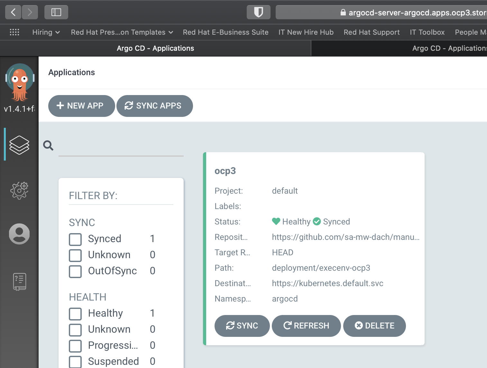

# Gitops demo
This document describes how to perform the basic gitops demo

## Demo Preparation (Sprint 1 + Sprint 2)


### Ensure that deployment dir is empty for target execution environments

The following example uses the OCP3+OCP4 execution environments, adapt accordingly when deploying to crc.

Make sure you do NOT move or delete the execenv-<targetenv>-placeholder-configmap to undeploy, otherwise you won’t be able to sync via ArgoCD UI
```bash
cd ~/manuela-gitops/deployment
ls execenv-ocp3

execenv-ocp3-placeholder-configmap.yaml			manuela-stormshift-line-dashboard-namespace.yaml	manuela-stormshift-messaging-namespace.yaml
manuela-stormshift-line-dashboard-application.yaml	manuela-stormshift-messaging-application.yaml		manuela-stormshift-messaging-operatorgroup.yaml

ls execenv-ocp4

execenv-ocp4-placeholder-configmap.yaml			manuela-stormshift-machine-sensor-application.yaml	manuela-stormshift-machine-sensor-namespace.yaml
```
The deployment are just symlinks, therefore simply delete the links
```bash
rm execenv-ocp3/manuela-stormshift*
rm execenv-ocp4/manuela-stormshift* undeployed
rm nwpath-ocp3-ocp4/*
```

### Disable temperature in sensor 2 / revert to default (which is disabled)
```bash
cd ~/manuela-gitops/config/instances/manuela-<yourenv>/machine-sensor
```
OSX
```bash
sed -i ''c '/SENSOR_TEMPERATURE_ENABLED/d' machine-sensor-2-configmap.properties
```
Linux
```bash
sed -i '/SENSOR_TEMPERATURE_ENABLED/d' machine-sensor-2-configmap.properties
```
Commit changes to Git
```bash
cd ~/manuela-gitops
git add .
git commit -m "undeploy ocp3/ocp4 to prepare for test deployment"

[master 03e0c62] undeploy ocp3/ocp4 to prepare for test deployment

 7 files changed, 0 insertions(+), 0 deletions(-)

 rename deployment/{execenv-ocp3 => undeployed}/manuela-stormshift-line-dashboard-application.yaml (100%)

 rename deployment/{execenv-ocp3 => undeployed}/manuela-stormshift-line-dashboard-namespace.yaml (100%)

 rename deployment/{execenv-ocp4 => undeployed}/manuela-stormshift-machine-sensor-application.yaml (100%)

 rename deployment/{execenv-ocp4 => undeployed}/manuela-stormshift-machine-sensor-namespace.yaml (100%)

 rename deployment/{execenv-ocp3 => undeployed}/manuela-stormshift-messaging-application.yaml (100%)

 rename deployment/{execenv-ocp3 => undeployed}/manuela-stormshift-messaging-namespace.yaml (100%)

 rename deployment/{execenv-ocp3 => undeployed}/manuela-stormshift-messaging-operatorgroup.yaml (100%)

git push

Enumerating objects: 11, done.
Counting objects: 100% (11/11), done.
Delta compression using up to 4 threads
Compressing objects: 100% (6/6), done.
Writing objects: 100% (6/6), 925 bytes | 462.00 KiB/s, done.
Total 6 (delta 4), reused 0 (delta 0)
remote: Resolving deltas: 100% (4/4), completed with 4 local objects.
To https://github.com/sa-mw-dach/manuela-gitops.git
   f583608..03e0c62  master -> master
```
### Sync ArgoCD

This should happen automatically, but can be triggered through the ArgoCD UI and/or CLI




### Validate Application Namespaces & Components no longer exist in OpenShift (and ArgoCD)

E.g. via UI or CLI (see Logins & URL Chapter for Links)
```bash
**oc get projects | grep manu**
```


## GitOps Deployment

Sprint 1 contains basic GitOps Demo with Argo and a 1 first runtime. The GitOps demo deploys the runtime with sensor(s), AMQ Broker and the web app.

### Show empty environment(s) & empty ArgoCD UI

Same as during demo prep.

### Review GitOps Application Configuration & Deployment approach

Depending on the audience, this can be done quickly or in depth