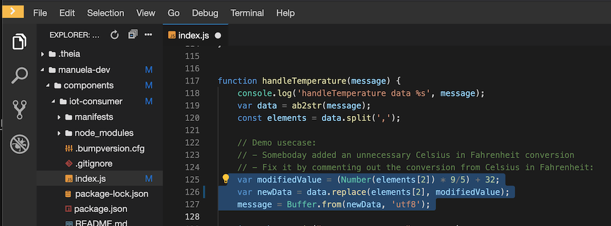
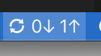

# Code Change with Cloud IDE
This demo modules show how to implement a code change to manuela component using CodeReady Workspaces as Cloud IDE.
The story is that in the code processing temperature data, there is an unnecessary  conversion from celsius to fahrenheit that needs to be removed.

## Preparation
1. Make sure Code Ready Workspace (CRW) is installed as described in the [SETUP](SETUP.md) guide.
1. The workspace must be setup and prepared. See the setup instructions. If you have a lot of time for the demo, you could do the prep in the demo to explain and show the stuff.
1. Check that the source code we are going to remove in manuela-dev/components/iot-consumer/index.js, line 117  is NOT commented out and looks like this:

## Execution
Perform the demo with the following steps.

### Step 1: Login to CRW and open Workspace.
1. Login to CRW using the bookmark created during setup.
1. Open the workspace you prepared during the setup

### Step 2: Show the bug
1. Open the iot-frontend in the dev environment, check that the bug is visible there. The temperatures values are way to high, alerts firing all the time:  

### Step 3: Fix the bug
1. Fix the bug by adding the comments, don't forget to save if you disabled auto save!  

1. The component will be restarted immediately.
1. Verify the bug is fixed in the dev environment (notice the steep step, below the red limit line):  

### Step 4: Commit changes
Using the git view on the left hand side:  

### Step 5: Push changes to git
Using the synchronize button in the lower status bar:  

### Step 6: Summary

Summarize what has happened: a developer has made a code change, tested in locally in her Cloud IDE. Finally, the code change was pushed to the git repo.

This demo module is now complete. Continue with the CI/CD Pipeline module.

