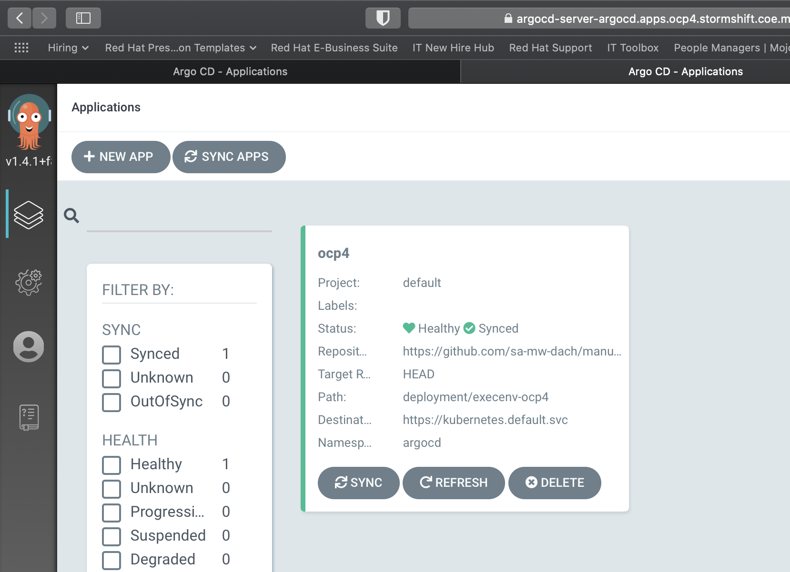
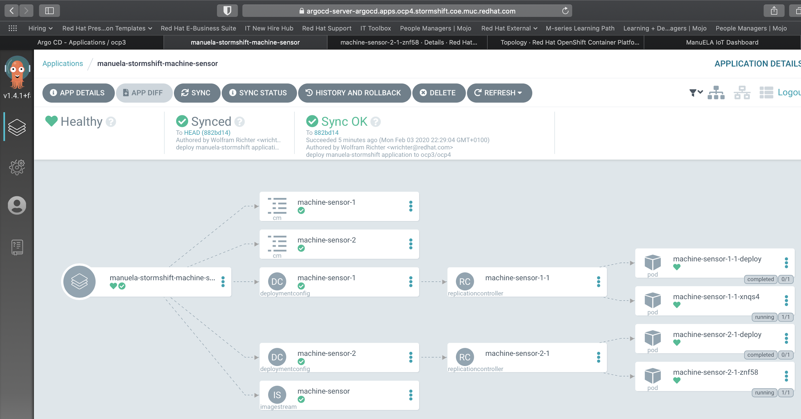
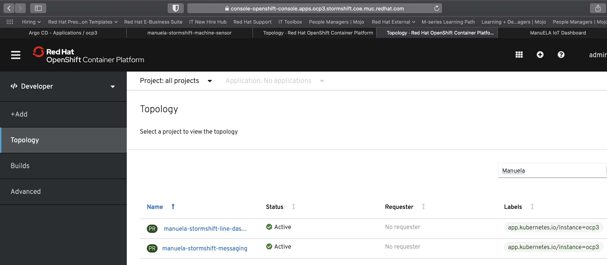
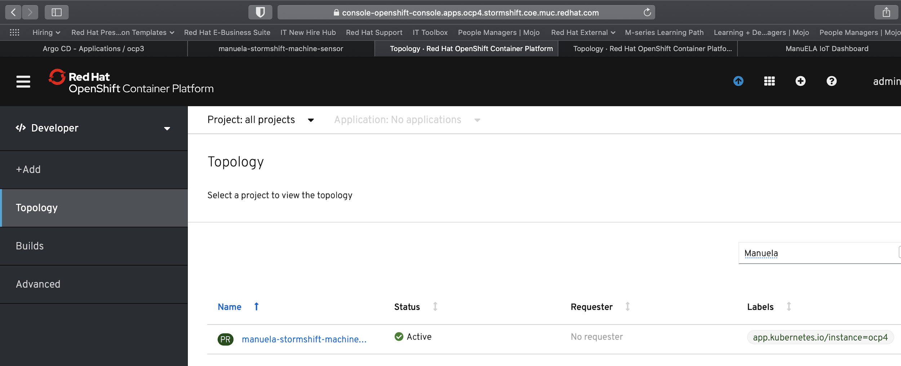
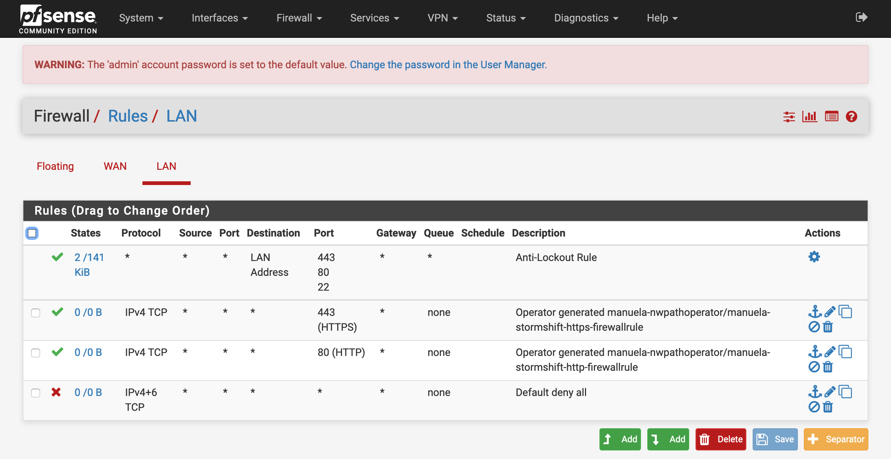

# Gitops App Deployment <!-- omit in toc -->
This document describes how to prepare & execute the basic gitops app deployment demo

- [Prerequisites](#prerequisites)
- [Demo Preparation](#demo-preparation)
  - [Ensure that deployment dir is empty for target execution environments](#ensure-that-deployment-dir-is-empty-for-target-execution-environments)
  - [Sync ArgoCD](#sync-argocd)
  - [Validate Application Namespaces & Components no longer exist in OpenShift (and ArgoCD)](#validate-application-namespaces--components-no-longer-exist-in-openshift-and-argocd)
  - [Clean Up Seldon WebHooks](#clean-up-seldon-webhooks)
- [Demo Execution](#demo-execution)
  - [Show empty environment(s) & empty ArgoCD UI](#show-empty-environments--empty-argocd-ui)
  - [Optional: Show current Firewall configuration](#optional-show-current-firewall-configuration)
  - [Review GitOps Application Configuration & Deployment approach](#review-gitops-application-configuration--deployment-approach)
    - [Application Templating Concept](#application-templating-concept)
    - [Application Instance configuration (in demo storyline: create app instance configuration)](#application-instance-configuration-in-demo-storyline-create-app-instance-configuration)
    - [Review app deployment information](#review-app-deployment-information)
  - [Deploy application](#deploy-application)
    - [Wait or trigger ArgoCD sync / Explain GitOps Repo Structure](#wait-or-trigger-argocd-sync--explain-gitops-repo-structure)
    - [Show application being deployed in ArgoCD](#show-application-being-deployed-in-argocd)
    - [Show application being deployed on OpenShift](#show-application-being-deployed-on-openshift)
    - [Show running application](#show-running-application)
  - [Optional: Show Firewall configuration change](#optional-show-firewall-configuration-change)
- [Mini Demo recording](#mini-demo-recording)

## Prerequisites

The demo environment(s) have been [bootstrapped](BOOTSTRAP.md).

## Demo Preparation

### Ensure that deployment dir is empty for target execution environments
Make sure you do NOT move or delete the execenv-<targetenv>-placeholder-configmap to undeploy, otherwise you won’t be able to sync via ArgoCD UI

```bash
cd ~/manuela-gitops/deployment
$ ls execenv-linedataserver/

execenv-linedataserver-placeholder-configmap.yaml	manuela-stormshift-machine-sensor-application.yaml

$ ls execenv-factorydatacenter/

execenv-factorydatacenter-placeholder-configmap.yaml	manuela-stormshift-line-dashboard-application.yaml
manuela-data-lake-factory-mirror-maker.yaml		manuela-stormshift-messaging-application.yaml

$ ls execenv-centraldatacenter/

execenv-centraldatacenter-placeholder-configmap.yaml	manuela-data-lake-central-kafka-cluster.yaml		manuela-tst-all-application.yaml
```

The deployment are just symlinks, therefore simply delete the links
```bash

rm execenv-linedataserver/manuela-stormshift*
rm execenv-factorydatacenter/manuela-stormshift*
rm execenv-centraldatacenter/manuela-stormshift*
rm nwpath-linedataserver-factorydatacenter/*
```

Commit changes to Git
```bash
cd ~/manuela-gitops
git add .
git commit -m "undeploy manuela-stormshift to prepare for test deployment"
git push
```
### Sync ArgoCD

This should happen automatically, but can be triggered through the ArgoCD UI and/or CLI




### Validate Application Namespaces & Components no longer exist in OpenShift (and ArgoCD)

E.g. via UI or CLI (see Logins & URL Chapter for Links)
```bash
**oc get projects | grep manu**
```


### Clean Up Seldon WebHooks

Uninstalling seldon-based workloads (e.g. anomaly detection) currently leaves WebHooks behind which cause subsequent deployments to fail. Check that all MutatingWebHooks and ValidatingWebHooks that are configured for seldon still work, or delete the WebHooks.


## Demo Execution

In the App Deployment GitOps demo you will deploy the an application over multiple environments, consisting of sensor(s), messaging layer with AMQ Broker and the web app.

### Show empty environment(s) & empty ArgoCD UI

Same as during [demo prep](#Validate-Application-Namespaces--Components-no-longer-exist-in-OpenShift-and-ArgoCD).

### Optional: Show current Firewall configuration

If the firewall configuration is in scope, show that the firewall configuration currently does not allow outbound traffic.


### Review GitOps Application Configuration & Deployment approach

Depending on the audience, this can be done quickly or in depth

#### Application Templating Concept
```bash
cd manuela-gitops/config/templates
```
multiple application templates exist (which can even reference one another)
```bash
ls

manuela		manuela-openshift	manuela-openshift-prod
```
Each application component has is configured in its own directory
```bash
ls manuela/

line-dashboard	machine-sensor	messaging
```
A component is configured via kustomize & k8s manifests (maybe explain kustomize here already)
```bash
ls manuela/machine-sensor/

kustomization.yaml			machine-sensor-dc.yaml			machine-sensor-is.yaml			service-client-messaging-configmap.yaml
```
Point out that some configuration parameters need to be adjusted for an application instance spanning namespaces or clusters
```bash
less manuela/machine-sensor/machine-sensor-1-configmap.yaml

apiVersion: v1
kind: ConfigMap
metadata:
  name: machine-sensor-1
data:
  APP_NAME: iot-sensor
  DEVICE_ID: pump-2
  DEVICE_METRICS: 'temperature,vibration,gps,light'
  MACHINE_ID: floor-1-line-1-extruder-1
  MQTT_HOSTNAME: broker-amq-mqtt-all-0-svc
  MQTT_PASSWORD: iotuser
  MQTT_PORT: '61616'
  MQTT_TLSSNI: 'false'
  MQTT_USER: iotuser
  SENSOR_GPS_ENABLED: 'false'
  SENSOR_GPS_FINAL_LATITUDE: '40.689879'
  SENSOR_GPS_FINAL_LONGITUDE: '-73.992895'
...
```
#### Application Instance configuration (in demo storyline: create app instance configuration)

Navigate to the application instance of your choice
```bash
cd manuela-gitops/config/instances
ls

manuela-crc		manuela-tst-all	manuela-stormshift

cd manuela-stormshift
ls

line-dashboard	machine-sensor	messaging
```
Review kustomization of machine sensor (name of route is autogenerated by operator based on namespace + svc name)
```bash
ls machine-sensor

kustomization.yaml		machine-sensor-1-configmap.yaml	machine-sensor-2-configmap.yaml

cat machine-sensor/machine-sensor-1-configmap.yaml

apiVersion: v1
kind: ConfigMap
metadata:
  name: machine-sensor-1
data:
  MQTT_HOSTNAME: broker-amq-mqtt-all-0-svc-rte-manuela-stormshift-messaging.apps.ocp3.stormshift.coe.muc.redhat.com
  MQTT_PORT: '80'
```
Review kustomization of messaging layer
```bash
ls messaging

kustomization.yaml	route.yaml

cat messaging/route.yaml

apiVersion: route.openshift.io/v1
kind: Route
metadata:
  name: messaging
spec:
  host: messaging-manuela-stormshift-messaging.apps.ocp3.stormshift.coe.muc.redhat.com
```
Review kustomization of line-dashboard
```bash
ls line-dashboard

kustomization.yaml		line-dashboard-configmap.yaml	line-dashboard-route.yaml

cat line-dashboard/line-dashboard-configmap.yaml

apiVersion: v1
kind: ConfigMap
metadata:
  name: line-dashboard-configmap
data:
  config.json: |-
    {
        "websocketHost": "http://messaging-manuela-stormshift-messaging.apps.ocp3.stormshift.coe.muc.redhat.com",
        "websocketPath": "/api/service-web/socket",
        "SERVER_TIMEOUT": 20000
    }
```
#### Review app deployment information
```bash
cd ~/manuela-gitops/config/instances/manuela-stormshift
```
Explain the individual files and what they represent (namespaces, argoCD applications, operatorgroup, ...)

### Deploy application

GitHub and similar workflows would allow an approval step to be inserted here

Move application deployments to their respective execution envs
```bash
cd ~/manuela-gitops/deployment
ln -s ../../config/instances/manuela-stormshift/manuela-stormshift-line-dashboard-application.yaml execenv-linedataserver
ln -s ../../config/instances/manuela-stormshift/manuela-stormshift-messaging-application.yaml execenv-factorydatacenter
ln -s ../../config/instances/manuela-stormshift/manuela-stormshift-machine-sensor-application.yaml execenv-centraldatacenter
```
If the firewall demo is in scope, add links to the appropriate firewall rules
```bash
ln -s ../../config/instances/manuela-stormshift/manuela-stormshift-http-firewallrule.yaml nwpath-linedataserver-factorydatacenter
ln -s ../../config/instances/manuela-stormshift/manuela-stormshift-https-firewallrule.yaml nwpath-linedataserver-factorydatacenter
```
Commit changes to Git
```bash
cd ~/manuela-gitops
git add .
git commit -m "deploy manuela-stormshift application"
git push
```
#### Wait or trigger ArgoCD sync / Explain GitOps Repo Structure

This can take a couple of minutes, so you could also trigger it via UI or CLI (but this takes away some of the magic). You can fill the time by explaining more of the GitOps Repo Structure (see Background below).

Note that the ArgoCD UI doesn’t self refresh, so you need to reload it to see that the app components have been deployed

#### Show application being deployed in ArgoCD




#### Show application being deployed on OpenShift





#### Show running application


### Optional: Show Firewall configuration change
If the firewall configuration is in scope, show that the firewall configuration now allows outbound traffic for http and https.




## Mini Demo recording

[https://drive.google.com/open?id=1-wsnTpzTCJO821rZlMu5jG6xRmBnptfe](https://drive.google.com/open?id=1-wsnTpzTCJO821rZlMu5jG6xRmBnptfe)