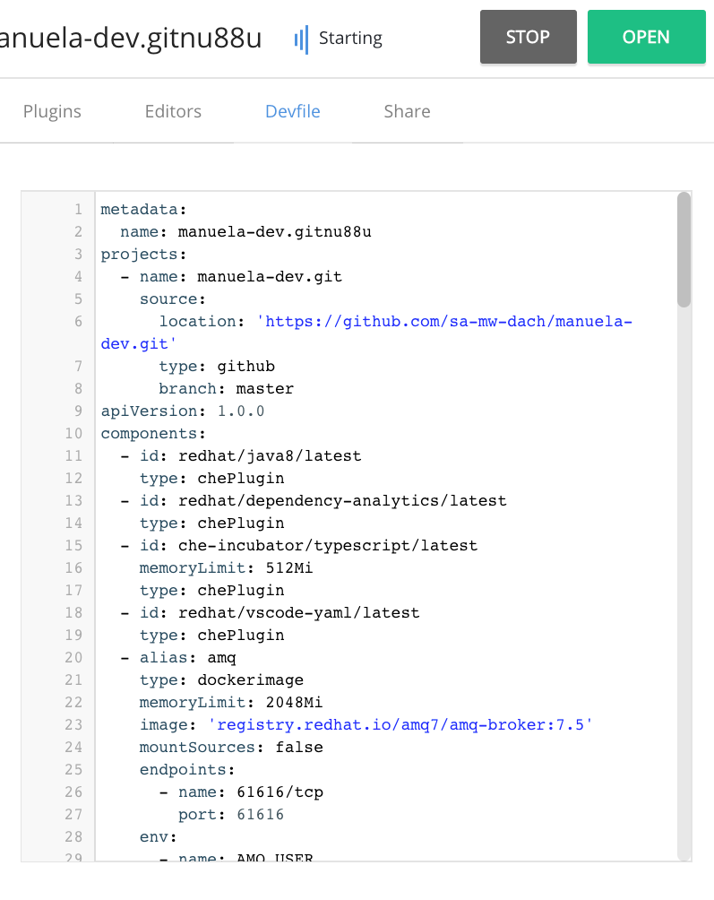
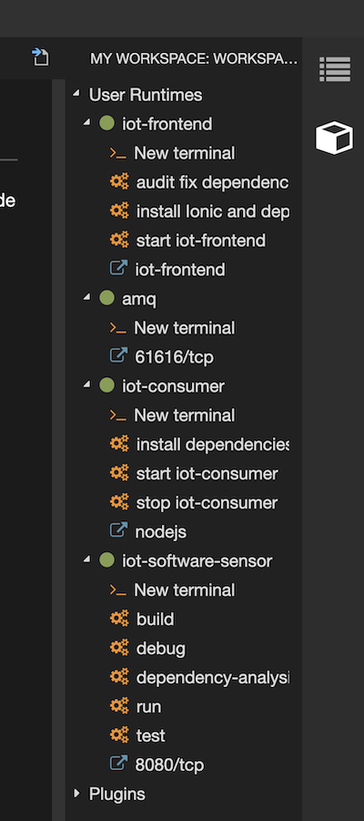
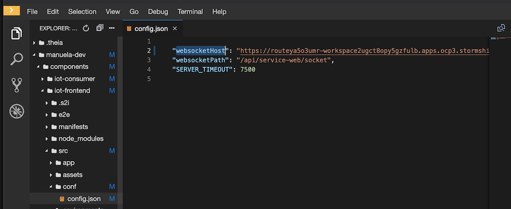
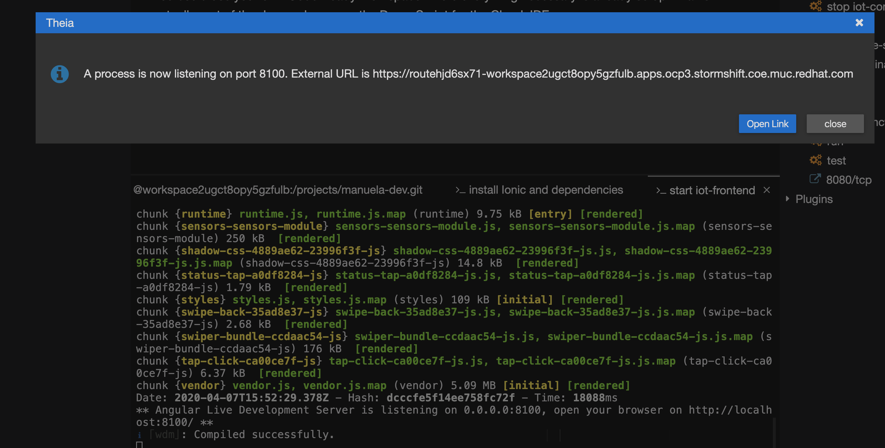
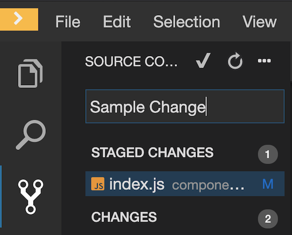
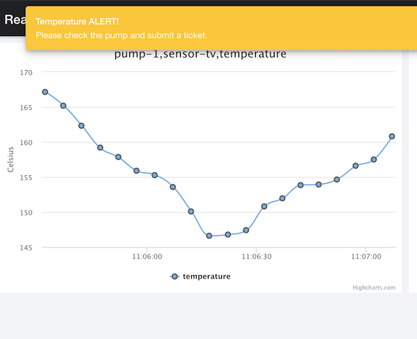
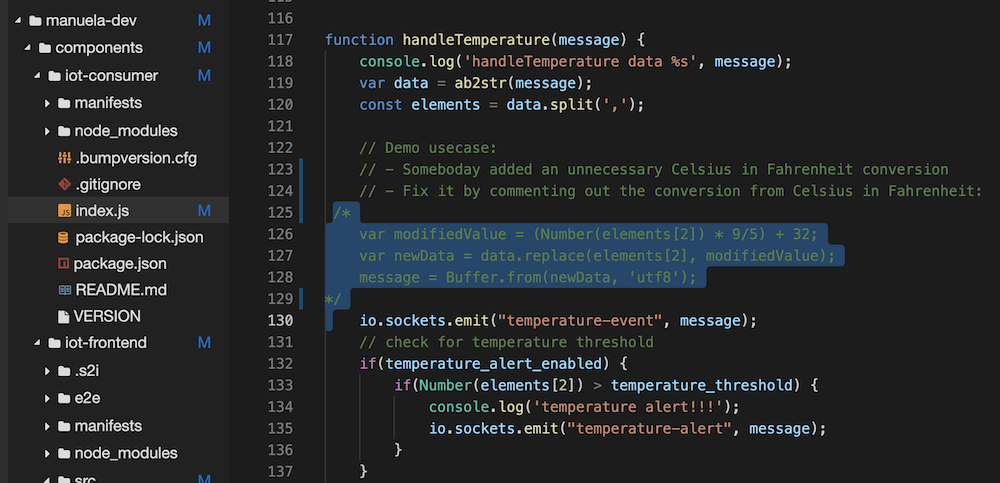
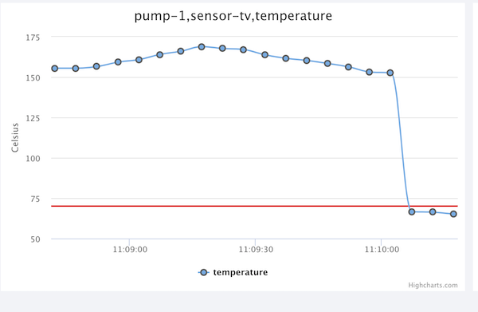

# Code Change with and without Cloud IDE <!-- omit in toc -->
This demo modules show how to implement a code change to manuela component, potentially using CodeReady Workspaces as Cloud IDE.
The story is that in the code processing temperature data, there is an unnecessary  conversion from celsius to fahrenheit that needs to be removed.

- [Prerequisites](#Prerequisites)
- [Demo Preparation](#Demo-Preparation)
  - [Code Change Prep](#Code-Change-Prep)
  - [Optional: Create CRW workspace](#Optional-Create-CRW-workspace)
  - [Optional: Prepare CRW Workspace](#Optional-Prepare-CRW-Workspace)
- [Demo Execution](#Demo-Execution)
  - [Step 1: Optional: Login to CRW and open Workspace (Alternative: use your favorite editor)](#Step-1-Optional-Login-to-CRW-and-open-Workspace-Alternative-use-your-favorite-editor)
  - [Step 2: Show the bug](#Step-2-Show-the-bug)
  - [Step 3: Fix the bug](#Step-3-Fix-the-bug)
  - [Step 4: Commit changes](#Step-4-Commit-changes)
  - [Step 5: Push changes to git](#Step-5-Push-changes-to-git)
  - [Step 6: Summary](#Step-6-Summary)

## Prerequisites

The demo environment(s) have been [bootstrapped](BOOTSTRAP.md) and Code Ready Workspace (CRW) is installed.

## Demo Preparation

If you want to demonstrate CRW, a workspace must be setup and prepared. If you have a lot of time for the demo, you could do the prep in the demo to explain and show the stuff.

### Code Change Prep

1. Check that the source code we are going to remove in manuela-dev/components/iot-consumer/index.js, line 117  is NOT commented out and looks like this:

TODO - replace image with actual text

### Optional: Create CRW workspace 
Duration: 10 minutes  
This creates your MANUela Cloud IDE workspace.
Click on this link [https://codeready-manuela-crw.apps.ocp3.stormshift.coe.muc.redhat.com/f?url=https://github.com/sa-mw-dach/manuela-dev](https://codeready-manuela-crw.apps.ocp3.stormshift.coe.muc.redhat.com/f?url=https://github.com/sa-mw-dach/manuela-dev) to create/clone your manuela-dev workspace in the CRW instance in the Stormshift OCP3 cluster.

By clicking the link above, CRW will start searching for a devfile.yaml in the root of the git repository. The devfile.yaml is the specification of a CodeReady workspace, i.e. what plugins, languages to provide etc.

After 4-5 minutes, the workspace should be open in your browser.

If not:
*  try to reload the page in the browser, or re-create the workspace from the CRW Dashboard.

* If the commands and plugins are missing:
    * From the CRW Workspaces, Choose the Configure Action: 

    * Stop the workspace: 

    * In the Devfile Section, add the "components:" and "commands:" section from this file: [https://github.com/sa-mw-dach/manuela-dev/blob/master/devfile.yaml](https://github.com/sa-mw-dach/manuela-dev/blob/master/devfile.yaml)

    * Start the workspace again

    * Make sure the git repo path is "manuela-dev". Sometimes it is "manuela-dev.git", which does not work. If it is with ".git" extension, you can simply right click and rename it.

### Optional: Prepare CRW Workspace 
Duration: 15 Minutes  
The devfile sets up a CRW workspace with all components setup in the local workspace (like you would have on your laptop):
* AMQ 7.5 message broker
* Java (SpringBoot) container for iot-software-sensor
* NodeJS container for iot-consumer
* angular/ionic container for iot-frontend
All these components run as separate containers inside the workspace pod.

There are runtimes and commands to help you do development.
For this to work, the workspace needs to be prepared / initialized, e.g. by downloading required dependencies etc.
There are commands prepared for this, you just have to execute them:
On the right hand side, find the user runtimes.

There you find the runtimes and commands. You can execute them by clicking on the command. Use the following sequence:
1. amq - make sure it is green, meaning AMQ is running already
2. iot-software-sensor
    * "run"
3. iot-consumer
    * "install dependencies"
    * "start iot-consumer" 
4. iot-frontend
    * "install ionic and dependencies". Watch the logs, there might be a question popping up! answer as you like. This step is required only the first time you start the workspace.
    * "Update iot-consumer URL config". This command reads the dynamic route for the iot-consumer component and updates the config file in iot-frontend. It prompts for an OpenShift Login. Please login to the local OpenShift with as user who has the permission to execute 'oc get route'. If it does not work, please manually change the route as described in the following step.  
    * Before you can start the frontend, you need to adapt the config to point the iot-consumer. Therefore, open manuela-dev/components/iot-frontend/src/conf/config.json. Replace the websocket path from "localhost" with the URL from the iot-consumer (click on the iot-consumer "link" in the runtimes). Should like like this: 

    * "start iot-frontend". This brings up the frontend serving component. Once it is running, you see the popup from crw on how to reach it: 
    You can either press "OpenLink", or use the next step.
    * Use "iot-frontend" link to open the "local" running frontend in your browser.

Voilá! Now you have all components running locally in your workspace.

Make sure you can push to the git repo. Commit a dummy change:  

Then push it using the sync button:  

You will be asked for your git credentials. If you have 2FA enabled in git, be sure to use your personal access token as password.

Logout ouf CRW to be prepared for the demo day:
1. Open the CRW side panel by clicking the yellow ">" on the upper left corner
1. Logout using the panel at the lower left corner in the CRW side panel

## Demo Execution
Perform the demo with the following steps.

### Step 1: Optional: Login to CRW and open Workspace (Alternative: use your favorite editor)
1. Login to CRW using the bookmark created during setup.
1. Open the workspace you prepared during the setup

### Step 2: Show the bug
1. Open the iot-frontend in the dev environment, check that the bug is visible there. The temperatures values are way to high, alerts firing all the time:  

### Step 3: Fix the bug
1. Fix the bug by adding the comments, don't forget to save if you disabled auto save!  

1. The component will be restarted immediately.
1. Verify the bug is fixed in the dev environment (notice the steep step, below the red limit line):  

### Step 4: Commit changes
Using the git view on the left hand side:  

### Step 5: Push changes to git
Using the synchronize button in the lower status bar:  

### Step 6: Summary

Summarize what has happened: a developer has made a code change, tested in locally in her Cloud IDE. Finally, the code change was pushed to the git repo.

This demo module is now complete. Continue with the CI/CD Pipeline module.

