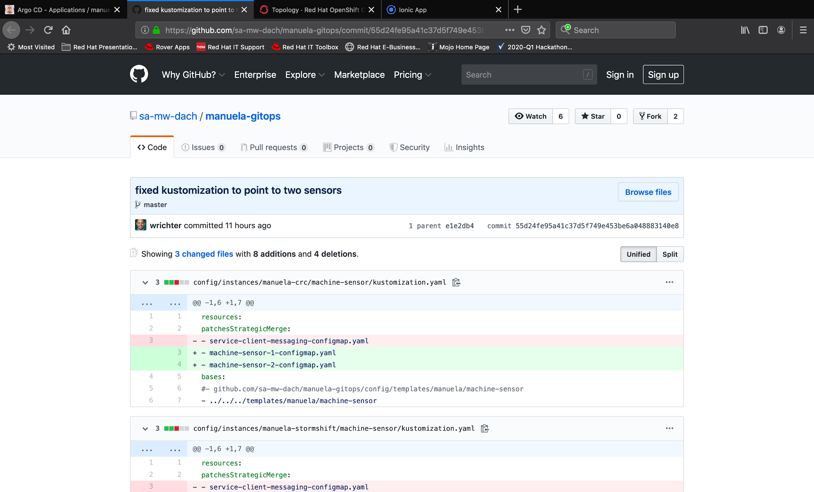

# Gitops Configuration Management  <!-- omit in toc -->
This document describes how to prepare & execute the  gitops config management demo

- [Prerequisites](#Prerequisites)
- [Demo Preparation](#Demo-Preparation)
  - [Disable temperature in sensor 2 / revert to default (which is disabled)](#Disable-temperature-in-sensor-2--revert-to-default-which-is-disabled)
  - [Sync ArgoCD](#Sync-ArgoCD)
- [Demo Execution](#Demo-Execution)
  - [Show that Sensor 2 currently does not send temperature data in Frontend Application](#Show-that-Sensor-2-currently-does-not-send-temperature-data-in-Frontend-Application)
  - [Wait for ArgoCD to sync application / trigger sync for machine-sensor](#Wait-for-ArgoCD-to-sync-application--trigger-sync-for-machine-sensor)
  - [Show that sensor now sends configuration data](#Show-that-sensor-now-sends-configuration-data)
  - [Review Change History](#Review-Change-History)

## Prerequisites

The demo environment(s) have been [bootstrapped](BOOTSTRAP.md).

This demo module is a continuation of the [basic gitops application deployment module](module-app-deployment.md). It can be prepared independently, but needs to be executed after it.

## Demo Preparation

### Disable temperature in sensor 2 / revert to default (which is disabled)
```bash
cd ~/manuela-gitops/config/instances/manuela-<yourenv>/machine-sensor
```

OSX
```bash
sed -i ''c '/SENSOR_TEMPERATURE_ENABLED/d' machine-sensor-2-configmap.properties
```

Linux
```bash
sed -i '/SENSOR_TEMPERATURE_ENABLED/d' machine-sensor-2-configmap.properties
```

```bash
cd ~/manuela-gitops
git add .
git commit -m "reset sensor 2 temperature probe"
git push
```
### Sync ArgoCD

This should happen automatically, but can be triggered through the ArgoCD UI and/or CLI


## Demo Execution

### Show that Sensor 2 currently does not send temperature data in Frontend Application

<TBD Frontend Application>

Adapt Application Instance configuration
```bash
cd ~/manuela-gitops/config/instances/manuela-<yourexecenv>/machine-sensor
echo "SENSOR_TEMPERATURE_ENABLED=true" >>machine-sensor-2-configmap.properties
cat machine-sensor-2-configmap.properties

MQTT_HOSTNAME=broker-amq-mqtt-all-0-svc-rte-manuela-stormshift-messaging.apps.ocp3.stormshift.coe.muc.redhat.com
MQTT_PORT=80
SENSOR_TEMPERATURE_ENABLED=true
```
Commit changes to Git

Similar to Sprint 1

### Wait for ArgoCD to sync application / trigger sync for machine-sensor

Similar to Sprint 1

**TODO - how can this be triggered automatically?**

(Watch out: on CRC, sometimes this deployment is OOM killed and no change takes place).

### Show that sensor now sends configuration data


### Review Change History

In the ArgoCD UI, navigate to the machine-sensor application.


Click on the git commit hashcode to open the commit in GitHub.

