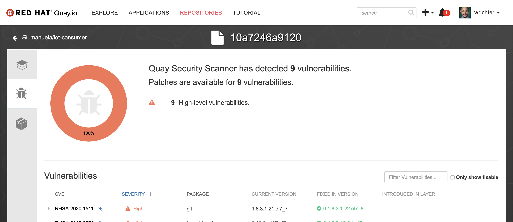
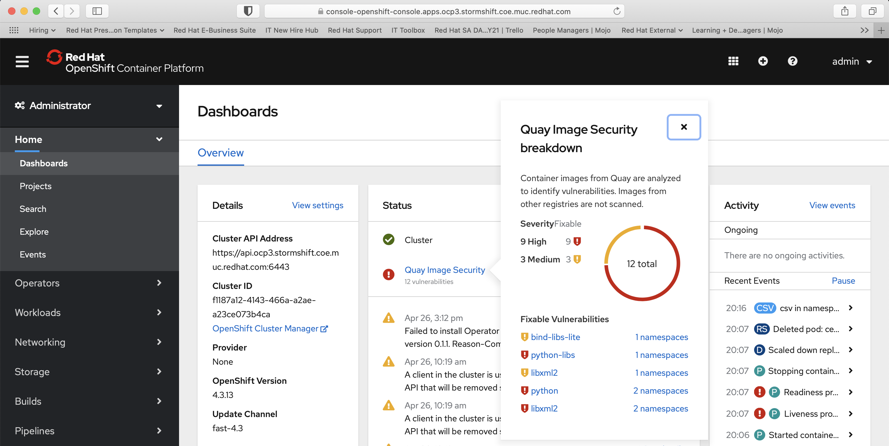

registry

# Enterprise Container  <!-- omit in toc -->
This document describes how to prepare & execute the enterprise container demo module.

- [Prerequisites](#Prerequisites)
- [Demo Preparation](#Demo-Preparation)
- [Demo Execution](#Demo-Execution)
  - [Explain Background](#Explain-Background)
  - [Container Security Assessment](#Container-Security-Assessment)
  - [In cluster image caching](#In-cluster-image-caching)

## Prerequisites

The demo environment(s) have been [bootstrapped](BOOTSTRAP.md). Also, you can optionally install the Container Security Operator. The operator takes a while to gather the vulnerability data from quay, so install this ahead of the demo.

## Demo Preparation
- Ensure you have all credentials for quay.io and the OCP cluster you use at hand.

## Demo Execution

### Explain Background
Show [Slide#32](https://docs.google.com/presentation/d/1XRQ_mn8VBWQkYkouFtYs21gCGLxtWJCPLstybYY8cE4/edit#slide=id.g7dca648235_0_806) and elaborate on the role of the image registry:

### Container Security Assessment
Show quay.io and the [manuela repo](https://quay.io/organization/manuela) there
Highlight container security scanning in quay.

If the Container Security Operator is installed, you can see this security information being reflected in the OpenShift Console. 

Click on the "x namespaces" link next to one of the vulnerabilities. You can see which namespaces are affected. Click on the vulnerability object and you can see which pods are affected. In the YAML view, you can see more details on the affected packages.

With OCP 4.4 onwards, there will be a separate entry for image vulnerabilities in the Admin console.

### In cluster image caching
Show an image stream in the “remote” cluster, e.g. for the line-dashboard.

Elaborate on how it pulls through the images to ensure availability even when disconnected (“Reference Policy: local”)
