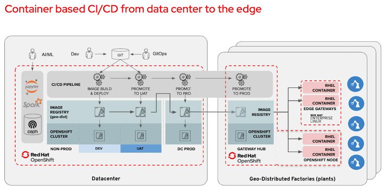

registry

# Enterprise Container  <!-- omit in toc -->
This document describes how to prepare & execute the enterprise container demo module.

## Prerequisites

The demo environment(s) have been [bootstrapped](BOOTSTRAP.md).

## Demo Preparation
- Ensure you have all credentials for quay.io and the OCP cluster you use at hand.

## Demo Execution

1. Show [Slide#32](https://docs.google.com/presentation/d/1XRQ_mn8VBWQkYkouFtYs21gCGLxtWJCPLstybYY8cE4/edit#slide=id.g7dca648235_0_806) and elaborate on the role of the image registry:

2. Show quay.io and the [manuela repo](https://quay.io/organization/manuela) there
Highlight container security scanning in quay

1. Show an image stream in the “remote” cluster (e.g. for [line-dashboard](https://console-openshift-console.apps.ocp3.stormshift.coe.muc.redhat.com/k8s/ns/manuela-stormshift-line-dashboard/imagestreams/line-dashboard))

1. Elaborate on how it pulls through the images to ensure availability even when disconnected (“Reference Policy: local”)
