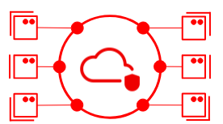

# Machine Learning in a Public Cloud on Red Hat OpenShift Date Science (RHODS)<!-- omit in toc -->
This document describes how to prepare & execute the machine learning demo on RHODS

- [Demo Preparation/ or possible Demo Usecase](#demo-preparation-or-possible-demo-usecase)
  - [Deploy OpenDataHub with a JupyterHub on the Red Hat OpenShift Data Science (RHODS)](#deploy-opendatahub-with-a-jupyterhub-on-the-red-hat-openshift-data-science-rhods)
- [Demo Execution](#demo-execution)
  - [Demo ML modeling on RHODS](#demo-ml-modeling-on-rhods)

## Demo Preparation/ or possible Demo Usecase

The demo is based on the internal Red Hat OpenShift Data Science (https://source.redhat.com/groups/public/rhodsinternal), but can be doployed on a customer specific OpenShift Data Science, too.

### Deploy OpenDataHub with a JupyterHub on the Red Hat OpenShift Data Science (RHODS)

- Go to https://source.redhat.com/groups/public/rhodsinternal and find the place where you can get support on the internal offer of Red Hat OpenShift Data Science.

- Look for the Link https://red.ht/rhods-internal and use it to reach the login page for RHODS.

- Click "Log in with OpenShift". Then choose RedHat-Google-Auth.

You should now see the Dashboard of the RHODS. Under the menu point "Applications -> Enabled" you see the all the applications that you can lunch. 
In our case you have to look for "JupyterHub". Then press "Launch application"

Option 1: Loade necessary data through a Terminal

In your newly created JupyterHub you know need to create a new tab. Click on blue button with the "+" in it and choose under the headline "Other" a "Terminal"

With that Jupyter Terminal you can download with these commands direclty the neccessary documents from git:
```
curl -O https://raw.githubusercontent.com/sa-mw-dach/manuela-dev/master/ml-models/anomaly-detection/Anomaly-Detection-simple-ML-Training.ipynb

curl -O https://raw.githubusercontent.com/sa-mw-dach/manuela-dev/master/ml-models/anomaly-detection/raw-data.csv
```

Option 2: Load a Git repository

- Load the repository: ```Git``` -> ```Add Remote Repository```
- Enter this link: https://github.com/sa-mw-dach/manuela-dev.git
- Open in the left column the folder ```manueladev``` -> ```ml-models``` -> ```anomaly-detection``` 

## Demo Execution

### Demo ML modeling on RHODS

**Demo the notebook**

Open the notebook ```Anomaly-Detection-simple-ML-Training.ipynb``` with a click on the file on the left column.

Option 1: Lightweigt demo
- All output cells are populated. Don't run any cells. 
- Walk through the content and explain the high level flow.

Option 2: Full demo
- Clear current outputs: ```Edit``` -> ```Clear All Outputs```
- Run each cell by clicking in the bash cell then press \[Shift]\[Enter] and explain each step.

