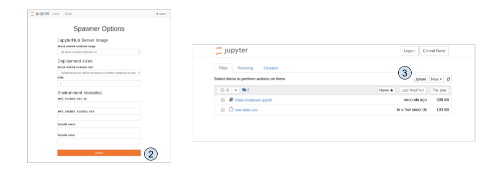

# Machine Learning <!-- omit in toc -->
This document describes how to prepare & execute the machine learning demo

- [Prerequisites](#prerequisites)
- [Demo Preparation](#demo-preparation)
  - [Pre Demo Checks](#pre-demo-checks)
  - [Deploy OpenDataHub with a JupyterHub in the Manuela-ML-Workspace](#deploy-opendatahub-with-a-jupyterhub-in-the-manuela-ml-workspace)
- [Demo Execution](#demo-execution)
  - [Demo ML modeling](#demo-ml-modeling)

## Prerequisites

The demo based environment have been [bootstrapped](BOOTSTRAP.md).

[See Machine Learning based Anomaly Detection and Alerting](BOOTSTRAP.md#machine-learning-based-anomaly-detection-and-alerting-optional)

## Demo Preparation

The demo prepation is focusing on the Data Scientist workbench which is a OpenShift powered  [Open Data Hub](https://opendatahub.io/).

Environments:
- OCP3: Predeployed Manuela-ML-Workspace
- OCP4: Deploy Manuela-ML-Workspace during the demo (optional)
- CRC: Deploy the Manuela-ML-Workspace in you own environments for any use case

This guide assumes that you are using the stormshift environment.

### Pre Demo Checks
- Ensurure that the Manuela-ML-Workspace is deployed and functioning on OCP3
- Delete the Manuela-ML-Workspace of OCP4 in case you like to show the deployment.

### Deploy OpenDataHub with a JupyterHub in the Manuela-ML-Workspace

The Manuela-ML-Workspace should exists or be deployed on **OCP3** before running the demo.
You can deploy the Manuela-ML-Workspace during the demo on **OCP4** or your **CRC** in case you like to show how to deploy the Open Data Hub and upload the Jupyter and training data.

Let's use ocp4 during the following steps. Login into ocp4 as admin or with admin privileges:
```bash
oc login -u XXX -p XXXX --server=https://api.ocp4.stormshift.coe.muc.redhat.com:6443
```

Please clone the  ```manuela``` repository into your home directory. This repo contains everything required to set up the  demo. You can choose a different directory, but the subsequent docs assume it to reside in ~/manuela-dev .

```bash
cd ~
git clone https://github.com/sa-mw-dach/manuela.git
```

**Deploy the OpenDataHub Operator**

Starting with ODH V0.6, it is a global operator. To deploy it, use

```bash
cd  ~/manuela/namespaces_and_operator_subscriptions/opendatahub
oc apply -k .
```
If ```oc apply -k .``` fails, please try ``` kustomize build . | oc apply -f - ```

Wait a minute until the operator is running:
```bash
oc get pods -n openshift-operators
NAME                                    READY   STATUS    RESTARTS   AGE
opendatahub-operator-546d49d59b-qd8hz   1/1     Running   0          48s
```


**Deploy a OpenDataHub instance with a JupyterHub in the Manuela-ML-Workspace namespace**
```bash
cd  ~/manuela/infrastructure/opendatahub
oc apply -k . 
```


Follow the instantiation of the jupyterhub in the OpenShift Console or using oc:  
```bash
oc get pods -w -n manuela-ml-workspace
```

**Launch a Jupyterhub**  

Get the Jupyterhub Url either from the route in the OpenShift Console or using oc::

```bash

echo https://$(oc get route jupyterhub -o jsonpath='{.spec.host}' -n manuela-ml-workspace )
```
https://jupyterhub-manuela-ml-workspace.apps.ocp4.stormshift.coe.muc.redhat.com

1. Login with OpenShift credentials
2. Spwan a notebook ```s2i-minimal-notebook:3.6``` using the defaults
3. Upload ```Anomaly-Detection-simple-ML-Training.ipynb``` and ```raw-data.csv``` from ```~/manuela-dev/ml-models/anomaly-detection/```
   




## Demo Execution

### Demo ML modeling

**Demo the notebook**

Open the notebook ```Anomaly-Detection-simple-ML-Training.ipynb```

Option 1: Lightweigt demo
- All output cells are populated. Don't run any cells. 
- Walk through the content and explain the high level flow.

Option 2: Full demo
- Clear current outputs: ```Cell``` -> ```All Output``` -> ```Clear```
- Run each cell \[Shift]\[Enter] and explain each step.

**Demo model serving**

For keeping the demo setup simple, lets use  for show the model serving.

Show the running seldon pods in manuela-stormshift-messaging.

```bash
oc get pods -n  manuela-stormshift-messaging | grep 'seldon\|anomaly'
```

```
anomaly-detection-predictor-0-anomaly-detection-796887f9899c2jj   2/2     Running   0          22h
seldon-controller-manager-76d49f78b9-k7xc7                        1/1     Running   0          25h
```

**Test the anomaly detection service** 

Make a test call:
```
curl -k -X POST -H 'Content-Type: application/json' -d '{"data": { "ndarray": [[16.1,  15.40,  15.32,  13.47,  17.70]]}}' http://$(oc get route anomaly-detection -n manuela-stormshift-messaging -o jsonpath='{.spec.host}' -n manuela-stormshift-messaging )/api/v1.0/predictions
```

Output: 
```
{"data":{"names":[],"ndarray":[1]},"meta":{}}
```

The prediction is ```"ndarray":[1]```. This is an anomaly.


**Show logs to see anomaly-detection-predictor in action**

Either on the OpenShift console or using oc
```
oc logs $(oc get pod -l  seldon-app=anomaly-detection-predictor -o jsonpath='{.items[0].metadata.name}' -n manuela-stormshift-messaging) -c anomaly-detection -n manuela-stormshift-messaging
```

Expexted result:
```
 Predict features:  [[ 9.58866665  8.88145877 10.60920998 11.53665955 11.65813195]]
Prediction:  [0]
2020-05-03 17:40:13,481 - werkzeug:_log:113 - INFO:  127.0.0.1 - - [03/May/2020 17:40:13] "POST /predict HTTP/1.1" 200 -
 Predict features:  [[12.59645277 13.17329123 13.91231828 15.80360728 16.36178987]]
Prediction:  [0]
2020-05-03 17:40:15,958 - werkzeug:_log:113 - INFO:  127.0.0.1 - - [03/May/2020 17:40:15] "POST /predict HTTP/1.1" 200 -
 Predict features:  [[10.66335637  9.58866665  8.88145877 10.60920998 11.53665955]]
Prediction:  [0]
2020-05-03 17:40:18,549 - werkzeug:_log:113 - INFO:  127.0.0.1 - - [03/May/2020 17:40:18] "POST /predict HTTP/1.1" 200 -
 Predict features:  [[11.21156663 12.59645277 13.17329123 13.91231828 15.80360728]]
Prediction:  [0]
2020-05-03 17:40:20,601 - werkzeug:_log:113 - INFO:  127.0.0.1 - - [03/May/2020 17:40:20] "POST /predict HTTP/1.1" 200 -


```
