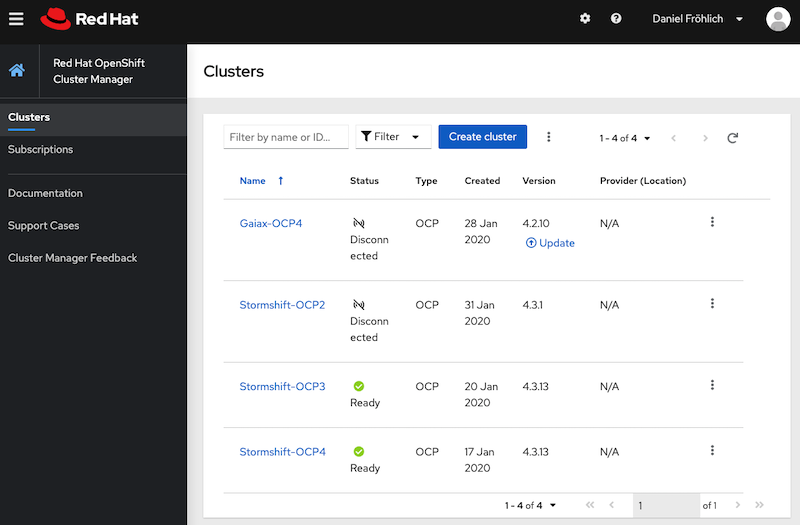
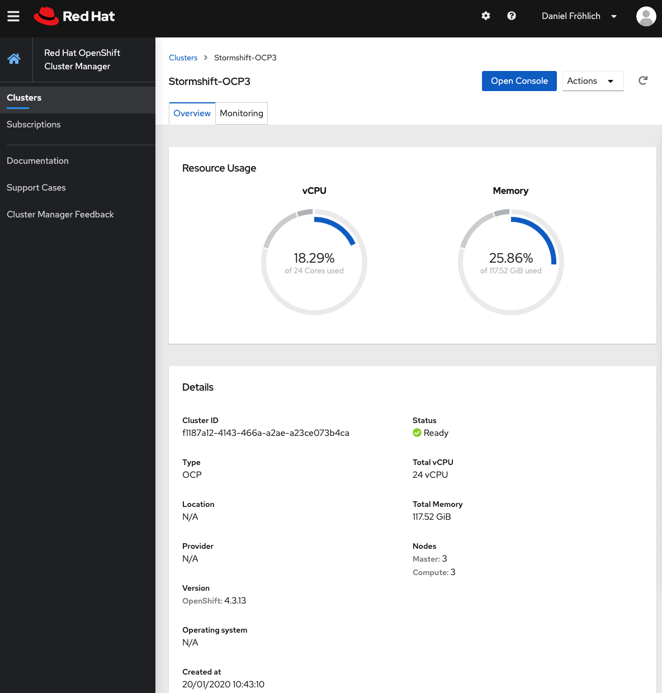

# Multi Cluster Management  <!-- omit in toc -->
This document describes how to prepare & execute the multi cluster management demo module.

## Prerequisites
None
 
## Demo Preparation
- Ensure you have access to cloud.redhat.com where the different clusters you use for your demo are visible.
- If you use the stormshift demo environment, this [mojo article](https://mojo.redhat.com/docs/DOC-1214112) describes how you can get access.

## Demo Execution

1. Login to [cloud.redhat.com](cloud.redhat.com)
1. Switch to the [OpenShift Cluster Manager](https://cloud.redhat.com/openshift/)
1. Show the status of the clusters (tip: use the one where the frontend-component is deployed to):

1. Drill down to one of the clusters, showing overview resource usage and monitoring:

   

1. As a transition to one of the other demo modules, you could use the "Open Console" to switch to the console. If you do that, be sure to ask for questions regarding 
   
   