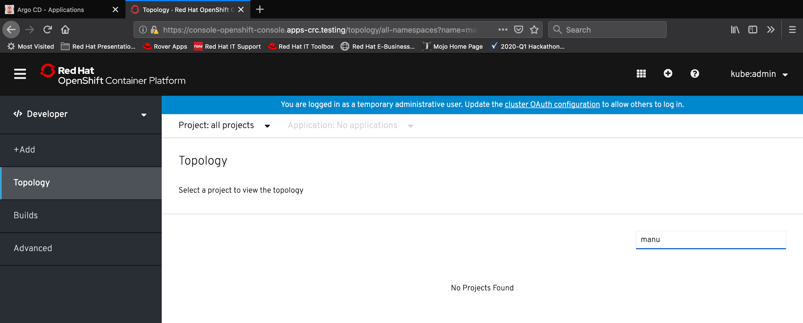
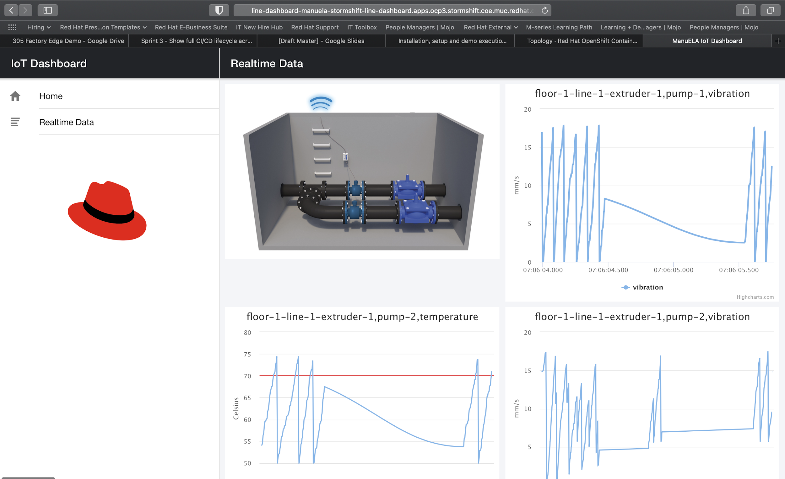
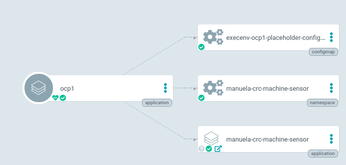
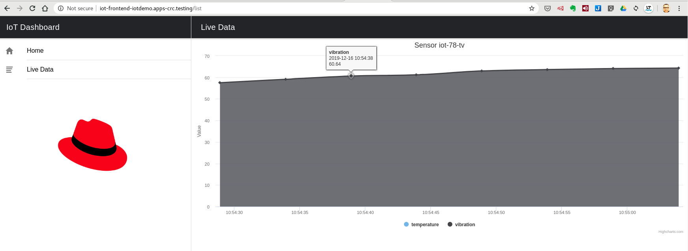

MANUela Demo installation, setup and demo execution notes

This doc is a temporary notebook for crafting the 1st version of the installation and setup instructions as well as instruction how to execute the demo.

**Please track any demo in the following sheet so we can understand how it is used:**

[https://docs.google.com/spreadsheets/d/17846bqUPEbXUmJ2i6KUYJ_k0yiJWmVW4flhKb83WDA4/edit#gid=0](https://docs.google.com/spreadsheets/d/17846bqUPEbXUmJ2i6KUYJ_k0yiJWmVW4flhKb83WDA4/edit#gid=0)

[[TOC]]

# Prerequisites and assumptions

* OCP 4.2+ is installed and running

* First target environments are Stormshift and CRC

# How to set up the Demo

**!!!moved to docs/documentation!!!**

# Demo Preparation (Sprint 1 + Sprint 2)

## Using stormshift as Demo-Environment

 The demo is developed and could be delivered using OpenShift cluster running on stormshift. Please see here for details regarding stormshift:

[https://mojo.redhat.com/groups/solution-architects/projects/stormshift/overview](https://mojo.redhat.com/groups/solution-architects/projects/stormshift/overview)

Sprint 2 uses the clusters ocp4 and ocp3.

OCP3: [https://console-openshift-console.apps.ocp3.stormshift.coe.muc.redhat.com/k8s/cluster/projects](https://console-openshift-console.apps.ocp3.stormshift.coe.muc.redhat.com/k8s/cluster/projects)

OCP4: [https://console-openshift-console.apps.ocp4.stormshift.coe.muc.redhat.com/k8s/cluster/projects](https://console-openshift-console.apps.ocp4.stormshift.coe.muc.redhat.com/k8s/cluster/projects)

Users:

You can add your RedHatInternal SSO user to  the manuela-team group and gain admin access to all projects. Simply add your login to the the corresponding groups, example: [https://github.com/sa-mw-dach/manuela-gitops/blob/master/deployment/execenv-ocp4/groups.yml](https://github.com/sa-mw-dach/manuela-gitops/blob/master/deployment/execenv-ocp4/groups.yml)

Alternatively, you can use the following "Local" users:

manuela-dev (Representing the development group, ProjectAdmin-Role for all dev stages, ProjectView-Role for all prd stages)

manuela-ops (Representing the operations group, ProjectAdmin-Role for all prd stages, ProviewView-Role for all dev stages)

The password for the "Local" users is “manuela”

## Ensure that deployment dir is empty for target execution environments 

The following example uses the OCP3+OCP4 execution environments, adapt accordingly when deploying to crc.

Make sure you do NOT move or delete the execenv-<targetenv>-placeholder-configmap to undeploy, otherwise you won’t be able to sync via ArgoCD UI

**cd ~/manuela-gitops/deployment**

**ls execenv-ocp3**

execenv-ocp3-placeholder-configmap.yaml			manuela-stormshift-line-dashboard-namespace.yaml	manuela-stormshift-messaging-namespace.yaml

manuela-stormshift-line-dashboard-application.yaml	manuela-stormshift-messaging-application.yaml		manuela-stormshift-messaging-operatorgroup.yaml

**ls execenv-ocp4**

execenv-ocp4-placeholder-configmap.yaml			manuela-stormshift-machine-sensor-application.yaml	manuela-stormshift-machine-sensor-namespace.yaml

# the deployment are just symlinks, therefore simply delete the links

**rm execenv-ocp3/manuela-stormshift* **

**rm execenv-ocp4/manuela-stormshift* undeployed**

**rm nwpath-ocp3-ocp4/***

## Sprint 2: Disable temperature in sensor 2 / revert to default (which is disabled)

**cd ~/manuela-gitops/config/instances/manuela-<yourenv>/machine-sensor**

# OSX

**sed -i ''c '/SENSOR_TEMPERATURE_ENABLED/d' machine-sensor-2-configmap.properties **

# Linux

**sed -i '/SENSOR_TEMPERATURE_ENABLED/d' machine-sensor-2-configmap.properties**

## Commit changes to Git

**cd ~/manuela-gitops**

**git add .**

** git commit -m "undeploy ocp3/ocp4 to prepare for test deployment"**

[master 03e0c62] undeploy ocp3/ocp4 to prepare for test deployment

 7 files changed, 0 insertions(+), 0 deletions(-)

 rename deployment/{execenv-ocp3 => undeployed}/manuela-stormshift-line-dashboard-application.yaml (100%)

 rename deployment/{execenv-ocp3 => undeployed}/manuela-stormshift-line-dashboard-namespace.yaml (100%)

 rename deployment/{execenv-ocp4 => undeployed}/manuela-stormshift-machine-sensor-application.yaml (100%)

 rename deployment/{execenv-ocp4 => undeployed}/manuela-stormshift-machine-sensor-namespace.yaml (100%)

 rename deployment/{execenv-ocp3 => undeployed}/manuela-stormshift-messaging-application.yaml (100%)

 rename deployment/{execenv-ocp3 => undeployed}/manuela-stormshift-messaging-namespace.yaml (100%)

 rename deployment/{execenv-ocp3 => undeployed}/manuela-stormshift-messaging-operatorgroup.yaml (100%)

**git push**

Enumerating objects: 11, done.

Counting objects: 100% (11/11), done.

Delta compression using up to 4 threads

Compressing objects: 100% (6/6), done.

Writing objects: 100% (6/6), 925 bytes | 462.00 KiB/s, done.

Total 6 (delta 4), reused 0 (delta 0)

remote: Resolving deltas: 100% (4/4), completed with 4 local objects.

To https://github.com/sa-mw-dach/manuela-gitops.git

   f583608..03e0c62  master -> master

## Sync ArgoCD

This should happen automatically, but can be triggered through the ArgoCD UI and/or CLI 

### Validate Application Namespaces & Components no longer exist in OpenShift (and ArgoCD)

E.g. via UI or CLI (see Logins & URL Chapter for Links)

**oc get projects | grep manu**

# Sprint 1 - GitOps Deployment

Sprint 1 contains basic GitOps Demo with Argo and a 1 first runtime. The GitOps demo deploys the runtime with sensor(s), AMQ Broker and the web app.

## Show empty environment(s) & empty ArgoCD UI

Same as during demo prep.

## Review GitOps Application Configuration & Deployment approach

Depending on the audience, this can be done quickly or in depth

### Application Templating Concept

**cd manuela-gitops/config/templates**

# multiple application templates exist (which can even reference one another)

**ls**

manuela		manuela-openshift	manuela-openshift-prod

# each application component has is configured in its own directory

**ls manuela/**

line-dashboard	machine-sensor	messaging

# a component is configured via kustomize & k8s manifests (maybe explain kustomize here already)

**ls manuela/machine-sensor/**

kustomization.yaml			machine-sensor-dc.yaml			machine-sensor-is.yaml			service-client-messaging-configmap.yaml

# point out that some configuration parameters need to be adjusted for an application instance spanning namespaces or clusters

**less manuela/machine-sensor/machine-sensor-1-configmap.yaml**

apiVersion: v1

kind: ConfigMap

metadata:

  name: machine-sensor-1

data:

  APP_NAME: iot-sensor

  DEVICE_ID: pump-2

  DEVICE_METRICS: 'temperature,vibration,gps,light'

  MACHINE_ID: floor-1-line-1-extruder-1

  MQTT_HOSTNAME: broker-amq-mqtt-all-0-svc

  MQTT_PASSWORD: iotuser

  MQTT_PORT: '61616'

  MQTT_TLSSNI: 'false'

  MQTT_USER: iotuser

  SENSOR_GPS_ENABLED: 'false'

  SENSOR_GPS_FINAL_LATITUDE: '40.689879'

  SENSOR_GPS_FINAL_LONGITUDE: '-73.992895'

...

### Application Instance configuration (in demo storyline: create app instance configuration)

#navigate to the application instance of your choice

**cd manuela-gitops/config/instances**

**ls**

manuela-crc		manuela-tst-all	manuela-stormshift

**cd manuela-stormshift**

**ls**

line-dashboard	machine-sensor	messaging

# review kustomization of machine sensor (name of route is autogenerated by operator based on namespace + svc name)

**ls machine-sensor**

kustomization.yaml		machine-sensor-1-configmap.yaml	machine-sensor-2-configmap.yaml

**cat machine-sensor/machine-sensor-1-configmap.yaml**

apiVersion: v1

kind: ConfigMap

metadata:

  name: machine-sensor-1

data:

  MQTT_HOSTNAME: broker-amq-mqtt-all-0-svc-rte-manuela-stormshift-messaging.apps.ocp3.stormshift.coe.muc.redhat.com

  MQTT_PORT: '80'

# review kustomization of messaging layer

**ls messaging**

kustomization.yaml	route.yaml

**cat messaging/route.yaml**

apiVersion: route.openshift.io/v1

kind: Route

metadata:

  name: messaging

spec:

  host: messaging-manuela-stormshift-messaging.apps.ocp3.stormshift.coe.muc.redhat.com

# review kustomization of line-dashboard 

**ls line-dashboard**

kustomization.yaml		line-dashboard-configmap.yaml	line-dashboard-route.yaml

**cat line-dashboard/line-dashboard-configmap.yaml**

apiVersion: v1

kind: ConfigMap

metadata:

  name: line-dashboard-configmap

data:

  config.json: |-

    {

        "websocketHost": "http://messaging-manuela-stormshift-messaging.apps.ocp3.stormshift.coe.muc.redhat.com",

        "websocketPath": "/api/service-web/socket",

        "SERVER_TIMEOUT": 20000

    }

### Review app deployment information

**cd ~/manuela-gitops/config/instances/manuela-stormshift**

# Explain the individual files and what they represent (namespaces, argoCD applications, operatorgroup, ...)

## Deploy application

GitHub and similar workflows would allow an approval step to be inserted here

### Move application deployments to their respective execution envs 

**cd ~/manuela-gitops/deployment**

**ln -s ../../config/instances/manuela-stormshift/manuela-stormshift-line-dashboard-application.yaml execenv-ocp****3**

**ln -s ../../config/instances/manuela-stormshift/manuela-stormshift-messaging-application.yaml execenv-ocp****3**

**ln -s ../../config/instances/manuela-stormshift/manuela-stormshift-machine-sensor-application.yaml execenv-ocp****4**

# if the firewall demo is in scope, add links to the appropriate firewall rules

**ln -s ../../config/instances/manuela-stormshift/manuela-stormshift-http-firewallrule.yaml nwpath-ocp3-ocp4**

**ln -s ../../config/instances/manuela-stormshift/manuela-stormshift-https-firewallrule.yaml nwpath-ocp3-ocp4**

### Commit changes to Git

**cd ~/manuela-gitops**

**git add .**

**git commit -m "deploy manuela-stormshift application to ocp3/ocp4"**

[master 882bd14] deploy manuela-stormshift application to ocp3/ocp4

 7 files changed, 0 insertions(+), 0 deletions(-)

 rename deployment/{undeployed => execenv-ocp3}/manuela-stormshift-line-dashboard-application.yaml (100%)

 rename deployment/{undeployed => execenv-ocp3}/manuela-stormshift-line-dashboard-namespace.yaml (100%)

 rename deployment/{undeployed => execenv-ocp3}/manuela-stormshift-messaging-application.yaml (100%)

 rename deployment/{undeployed => execenv-ocp3}/manuela-stormshift-messaging-namespace.yaml (100%)

 rename deployment/{undeployed => execenv-ocp3}/manuela-stormshift-messaging-operatorgroup.yaml (100%)

 rename deployment/{undeployed => execenv-ocp4}/manuela-stormshift-machine-sensor-application.yaml (100%)

 rename deployment/{undeployed => execenv-ocp4}/manuela-stormshift-machine-sensor-namespace.yaml (100%)

**git push**

Enumerating objects: 11, done.

Counting objects: 100% (11/11), done.

Delta compression using up to 4 threads

Compressing objects: 100% (6/6), done.

Writing objects: 100% (6/6), 800 bytes | 800.00 KiB/s, done.

Total 6 (delta 4), reused 0 (delta 0)

remote: Resolving deltas: 100% (4/4), completed with 3 local objects.

To https://github.com/sa-mw-dach/manuela-gitops.git

   03e0c62..882bd14  master -> master

## Wait or trigger ArgoCD sync / Explain GitOps Repo Structure

This can take a couple of minutes, so you could also trigger it via UI or CLI (but this takes away some of the magic). You can fill the time by explaining more of the GitOps Repo Structure (see Background below).

Note that the ArgoCD UI doesn’t self refresh, so you need to reload it to see that the app components have been deployed

## Show application being deployed in ArgoCD

## Show application being deployed on OpenShift

## Show running application

## Mini Demo recording

[https://drive.google.com/open?id=1-wsnTpzTCJO821rZlMu5jG6xRmBnptfe](https://drive.google.com/open?id=1-wsnTpzTCJO821rZlMu5jG6xRmBnptfe)

# Sprint 2 - Multiple-Sensors and Config Change

## Show that Sensor 2 currently does not send temperature data in Frontend Application

<TBD Frontend Application>

## Adapt Application Instance configuration

**cd ~/manuela-gitops/config/instances/manuela-<yourexecenv>/machine-sensor**

**echo "SENSOR_TEMPERATURE_ENABLED=true" >>machine-sensor-2-configmap.properties**

**cat machine-sensor-2-configmap.properties**

MQTT_HOSTNAME=broker-amq-mqtt-all-0-svc-rte-manuela-stormshift-messaging.apps.ocp3.stormshift.coe.muc.redhat.com

MQTT_PORT=80

SENSOR_TEMPERATURE_ENABLED=true

## Commit changes to Git

Similar to Sprint 1

## Wait for ArgoCD to sync application / trigger sync for machine-sensor

Similar to Sprint 1

**TODO - how can this be triggered automatically?**

(Watch out: on CRC, sometimes this deployment is OOM killed and no change takes place).

## Show that sensor now sends configuration data

## Review Change History

In the ArgoCD UI, navigate to the machine-sensor application.

 

Click on the git commit hashcode to open the commit in GitHub.

# Background

### Key concepts

#### GitOps Principles applied to factory edge

[https://blog.openshift.com/introduction-to-gitops-with-openshift/](https://blog.openshift.com/introduction-to-gitops-with-openshift/)

<table>
  <tr>
    <td>The definition of our systems is described as code</td>
    <td>The configuration for our systems can be treated as code, so we can store it and have it automatically versioned in Git, our single source of truth.
That way we can rollout and rollback changes in our systems in an easy way.
</td>
  </tr>
  <tr>
    <td>The desired system state and configuration is defined and versioned in Git</td>
    <td>Having the desired configuration of our systems stored and versioned in Git give us the ability to rollout / rollback changes easily to our systems and applications.
On top of that we can leverage Git’s security mechanisms in order to ensure the ownership and provence of the code.</td>
  </tr>
  <tr>
    <td>Changes to the configuration can be automatically applied using PR mechanisms</td>
    <td>Using Git Pull Requests we can manage in an easy way how changes are applied to the stored configuration, you can request reviews from different team members, run CI tests, etc.
On top of that you don’t need to share your cluster credentials with anyone, the person committing the change only needs access to the Git repository where the configuration is stored.</td>
  </tr>
  <tr>
    <td>There is a controller that ensures no configuration drifts are present</td>
    <td>As the desired system state is present in Git, we only need a software that makes sure the current system state matches the desired system state. In case the states differ this software should be able to self-heal or notify the drift based on its configuration.
In this manufacturing ede use case we use ArgoCD as controller. The controller acts as deployment agent.</td>
  </tr>
</table>

The picture below illustrates the GitOps concepts in context of a factory edge use case. ArgoCD controllers ensure the desired state of the software and middleware components as well as the desired state of the configuration settings. 

#### Example: Desired software state and configuration state of a machine sensor

1. Deployment Agent Configuration: The argo application manifest [argocd-ocp1.yaml](https://github.com/sa-mw-dach/manuela-gitops/blob/master/meta/argocd-ocp1.yaml) in the [meta directory](https://github.com/sa-mw-dach/manuela-gitops/tree/master/meta) describes an "deployment agent configuration". ArgoCD is a specific implementation of a deployment agent. The application manifest points to a git source and the target OpenShift cluster. The git source contains the desired state of a concrete execution environment. In this example it is [deployment/execenv-ocp1](https://github.com/sa-mw-dach/manuela-gitops/tree/master/deployment/execenv-ocp1). 

2. Execution Environments Deployment Data: The execution environment [execenv-ocp1](https://github.com/sa-mw-dach/manuela-gitops/tree/master/deployment/execenv-ocp1) has multiple manifests. An Argo application and a namespace. The [namespace yaml](https://github.com/sa-mw-dach/manuela-gitops/blob/master/deployment/execenv-ocp1/manuela-crc-machine-sensor-namespace.yaml) configures the target namespace for the machine sensor. The machine sensor deployment is managed via the Argo application [manuela-crc-machine-sensor-application.yaml](https://github.com/sa-mw-dach/manuela-gitops/blob/master/deployment/execenv-ocp1/manuela-crc-machine-sensor-application.yaml) which uses a dedicated git repo and path ([config/instances/manuela-crc/machine-sensor](https://github.com/sa-mw-dach/manuela-gitops/tree/master/config/instances/manuela-crc/machine-sensor)) for the desired application instance of the machine sensor. By creating these manifests in the execution environment directory, the application is deployed. This means that the application instance configuration can be prepared, reviewed and approved before the actual deployment takes place.

3. Application Instance: In the current scenario, it is evident that many similar machine sensors in multiple execution environments need to be configured, deployed and managed. [Kustomize](https://kustomize.io/) simplifies the configuration of multiple machine sensors, because [Kustomize](https://kustomize.io/) is a template-free way to customize OpenShift application configuration. 
The Kustomize manifest [kustomization.yaml](https://github.com/sa-mw-dach/manuela-gitops/blob/master/config/instances/manuela-crc/machine-sensor/kustomization.yaml) points to a [basis directory](https://github.com/sa-mw-dach/manuela-gitops/tree/master/config/templates/manuela/machine-sensor) for the machine sensor deployment configuration. The config map [service-client-messaging-configmap.yaml](https://github.com/sa-mw-dach/manuela-gitops/blob/master/config/instances/manuela-crc/machine-sensor/service-client-messaging-configmap.yaml) in the instance directory specifies settings for the concrete sensor for this application instance.. In specific scenarios, the same application instance can be deployed to multiple execution environments - e.g. a globally load balanced application which creates the same endpoints / serves the same URLs in multiple clusters. 

4. Application Template: The [template directory](https://github.com/sa-mw-dach/manuela-gitops/tree/master/config/templates/manuela/machine-sensor) contains all required manifests for the machine sensor:  The [configmap](https://github.com/sa-mw-dach/manuela-gitops/blob/master/config/templates/manuela/machine-sensor/service-client-messaging-configmap.yaml) with settings for the MQTT endpoint, the [deployment config for the pod](https://github.com/sa-mw-dach/manuela-gitops/blob/master/config/templates/manuela/machine-sensor/machine-sensor-dc.yaml) and the [image stream](https://github.com/sa-mw-dach/manuela-gitops/blob/master/config/templates/manuela/machine-sensor/machine-sensor-is.yaml). Thanks to the kustomize functionality, there can be multiple levels of application templates: A production configuration can be based on a development configuration, etc...

  

### What does the demo deploy?

#### Machine-sensor to OCP1: argocd-ocp1.yaml:

* ocp1 (Argo CRD:  application) is a "deployment agent configuration" >  Source: deployment/execenv-ocp1

* Configmap: execenv-ocp1-placeholder-configmap. (*) 
*Placeholder only so that there is always some content for ArgoCD that can be synced even though nothing is deployed.

* Namespace: manuela-crc-machine-sensor: Namespace for the machine sensor 

* Application: manuela-crc-machine-sensor (Argo CRD) -> Source: config/instances/manuela-crc/machine-sensor

    * Configmap: service-client-messaging: Settings for MQTT Endpoint 

    * Deploymentconfig: machine-sensor: 

    * Imagestream: machine-sensor

#### Line Dashboard and messaging  to OCP2: argocd-ocp2.yaml:

#### OCP3: argocd-ocp3.yaml: (Use case?)

Note, the configmap placeholder is a workaround because Argo cannot handle updates on "empty" applications.

## IoT Runtime Demo

[https://github.com/sa-mw-dach/manuela-dev](https://github.com/sa-mw-dach/manuela-dev)

### Prerequisites

* Active MQArtemises Instance (?)

### Installation

git clone [git@github.com](mailto:git@github.com):sa-mw-dach/manuela-dev.git

cd manuela-dev/components/

oc apply -k .

ATT: 2x !!!

#### Installed AMQ Operator

#### Install Pods

#### Routes

#### Dashboard

