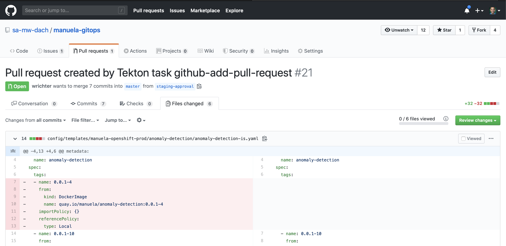

# Staging Concept <!-- omit in toc -->

The gitops repository uses only the single branch "master" to depict the
desired state of the deployments.

To stay within the git workflow concepts, changes staged for approval into
production are kept in a separate branch "staging-approval" in the same gitops
repository. This branch is created and populated automatically as part of the
CI/CD pipeline flows.

A pull request between staging-approval and master allows to review the changes
which are staged for production. Whoever is responsible for production can review and
approve or reject these changes.

If the changes are approved, the branch is merged into master. Optionally, the branch
can be deleted.

If the changes are rejected, the pull request is closed and the branch can be deleted 
(if the branch is not deleted, the changes will reappear in the next pull request).

